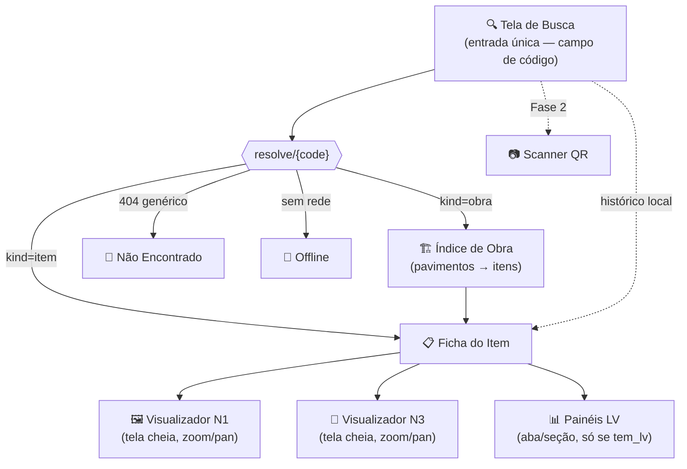
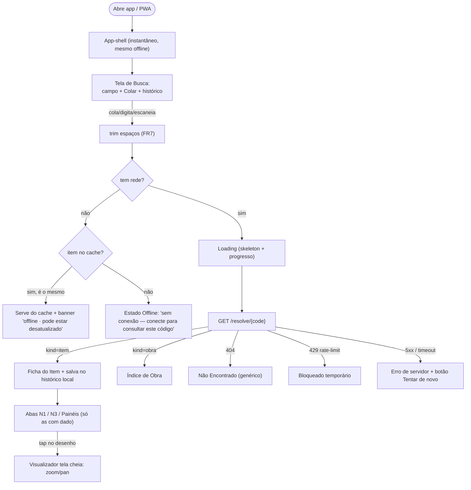
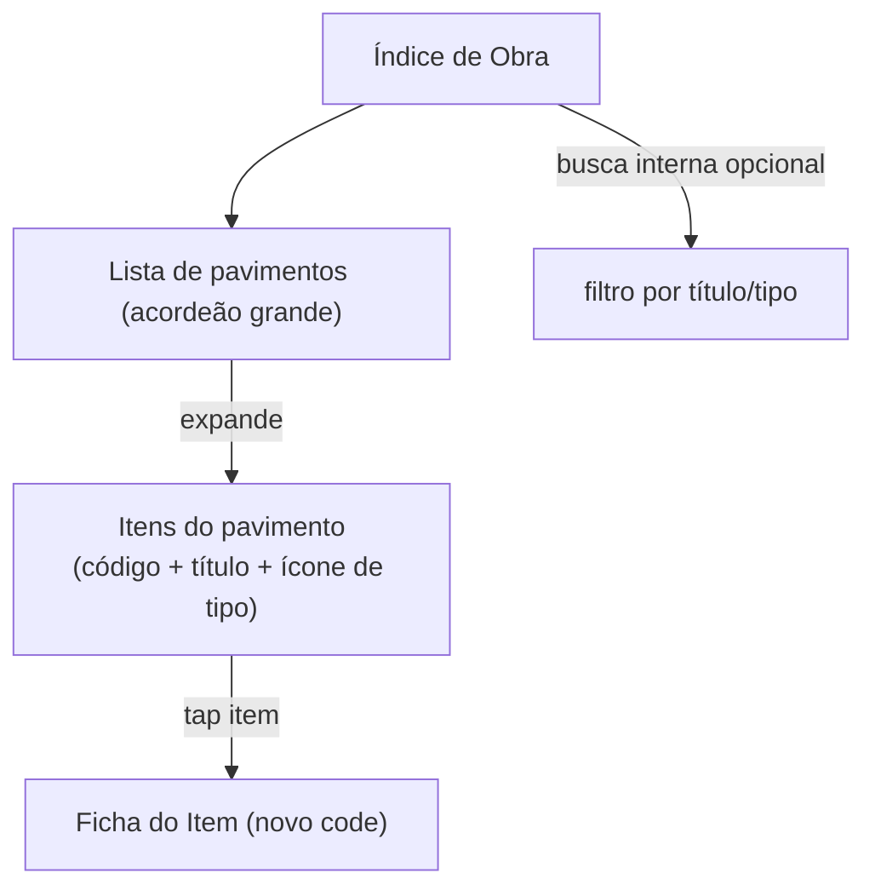
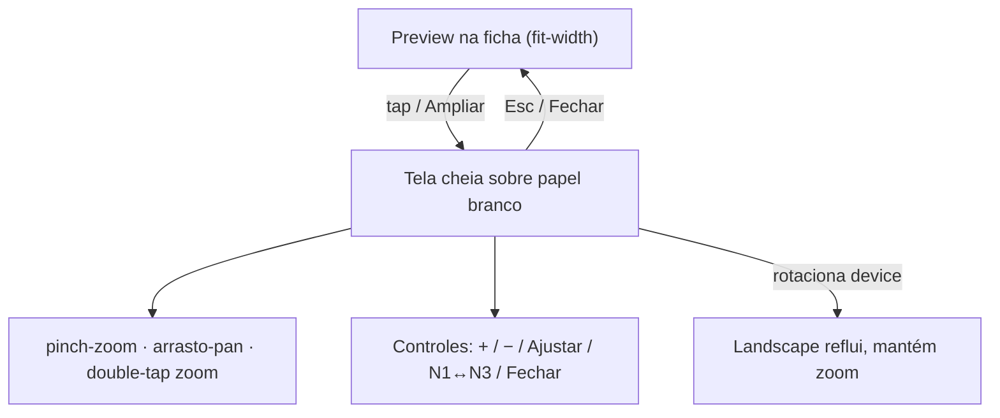

# Front-End Spec — App de Consulta Pública CAD-ANALYZER (Consulta de Fôrmas por Código)

> **Fase:** Design (UX/UI)
> **Autora:** Uma (AIOS UX-Design Expert) — para CEO-Planejamento (Athena)
> **Fontes:** `project-brief.md` (Atlas), `prd.md` (Morgan), `architecture.md` (Aria) — lidos nesta sessão
> **Data:** 2026-07-11
> **Status:** Decisiva. Wireframes em ASCII, tokens em hex, cada tela/estado especificado. Modo YOLO — decisões autônomas marcadas `[AUTO-DECISION]`.
> **Meta de conformidade:** WCAG 2.1 AA (contraste e alvo com folga extra por causa da luz solar).

---

## 0. TL;DR de design (leitura de 30 segundos)

| Eixo | Decisão | Porquê (1 linha) |
|---|---|---|
| **Fluxo** | 1 tela de entrada (campo de **código**) → resolve → Ficha (ou Índice de obra). 5 telas + 6 estados de erro/vazio | "Busca-primeiro"; zero menu antes da consulta |
| **Entrada do código** | Campo grande + botão **Colar** (lê clipboard) + **histórico local** dos últimos consultados (chips grandes) | Luvas, pressa; digitar base62 é penoso — colar/histórico/QR(F2) são o caminho real |
| **Tema** | **Light "canteiro" é o default** (branco puro, traço preto) + **Dark** opcional + toggle **"Sol forte"** que empurra contraste ao máximo | Luz solar direta = precisa de luminância alta, não de dark mode |
| **Desenho técnico** | SVG sempre renderizado sobre **papel branco**, mesmo no dark mode. Preview na ficha → tap abre **tela cheia** com pinch-zoom/pan/double-tap | Cota tem que ser lida sem perda; linha preta some em fundo escuro |
| **Toque** | Alvos **≥ 56px** (acima do mínimo 48px do WCAG), tipografia base **18px**, botão primário **64px** | Dedo enluvado + tela suja + movimento |
| **Offline** | App-shell + **último item** consultado disponíveis sem rede; badge de status **sempre visível** no topo | 3G/4G instável de canteiro |
| **Erro** | **Código não encontrado** é sempre a mesma mensagem genérica (não revela existência) — alinhado a NFR/FR6 | Anti-enumeração é requisito de segurança, não só UX |

---

## 1. Introdução

Este documento define objetivos de experiência, arquitetura de informação, fluxos, wireframes, design system (tokens) e requisitos de acessibilidade para a **App de Consulta Pública CAD-ANALYZER**. É a fundação para o handoff ao `@architect` (front-end-architecture) e ao `@dev` (implementação). Toda decisão aqui serve o cenário-âncora: **um funcionário de fôrma, de luvas, sob sol forte, com 3G ruim, precisa ver o desenho e as cotas certas em segundos, sem treinamento.**

### 1.1 Objetivos de UX (o que é "sucesso" para o usuário)

- **Aprendizado zero:** localizar N1/N3 + painéis LV na 1ª tentativa, sem instrução (NFR10 / KPI "sucesso sem treinamento ≥ 4 de 5").
- **Velocidade percebida:** do "colei o código" ao "vejo a ficha" em **< 3s (4G)**; app-shell abre instantâneo mesmo offline (NFR6/NFR8).
- **Legibilidade sob sol:** contraste e tamanho tais que a ficha seja lida a distância de braço, com reflexo de tela (NFR9).
- **Confiança na "verdade":** o usuário sente que aquilo é a versão atual e correta — indicador de conexão/atualização visível.
- **Recuperação sem frustração:** todo erro tem uma saída clara (tentar de novo, colar, ver histórico, seguir offline).

### 1.2 Princípios de Design (guias inegociáveis)

1. **Legibilidade acima de estética** — nada de gradiente, sombra sutil, cinza-sobre-cinza. Contraste alto, blocos sólidos, bordas visíveis. O canteiro não perdoa elegância frágil.
2. **O código é do usuário, não do sistema** — nunca pedir para "digitar o ID da obra"; pedir para **colar/escanear o código**. Colar e histórico são cidadãos de primeira classe.
3. **O desenho é sagrado** — SVG N1/N3 sempre em papel branco, zoom sem perda, controles grandes. É o dado que evita retrabalho.
4. **Offline é o estado normal, não a exceção** — projetar assumindo que a rede vai cair; degradar com clareza, nunca com tela branca.
5. **Silêncio seguro** — o app nunca revela se um código "existe mas não é seu". Erro é sempre genérico e idêntico (segurança embutida no texto da UI).
6. **Feedback imediato** — toda ação (colar, resolver, trocar aba, dar zoom) responde em < 100ms com estado visível (spinner, skeleton, mudança de cor).

### 1.3 Change Log

| Data | Versão | Descrição | Autora |
|------|--------|-----------|--------|
| 2026-07-11 | 0.1 | Front-end-spec inicial a partir de brief + PRD + architecture; 5 telas, 6 estados, tokens, SVG viewer, afordâncias de campo, WCAG AA | Uma (UX) |

---

## 2. Personas (reuso do PRD)

| # | Persona | Contexto de uso | O que o design deve garantir |
|---|---------|-----------------|------------------------------|
| **P1** | **Funcionário de Fôrma** (primária) | Fábrica/oficina, luvas, poeira, luz variável, mãos ocupadas | Contraste alto, toque ≥56px, N3+painéis LV em 1ª tentativa, colar/histórico |
| **P2** | **Construtor no Canteiro** (secundária) | Externo, sol forte, 3G ruim, movimento | Offline-first robusto, busca por código como 1º fluxo, QR (F2) preparado |
| **P3** | **Cliente** (terciária) | Desktop ou mobile controlado | Degradação graciosa para desktop, navegação por teclado, foco visível |

---

## 3. Arquitetura de Informação (IA)

### 3.1 Site Map / Inventário de Telas



**5 telas do MVP** (alinhadas a PRD §6.3): (1) Busca, (2) Índice de Obra, (3) Ficha do Item, (4) Visualizador de Desenho (tela cheia), (5) Não Encontrado. Estados transversais: Loading, Offline, Bloqueado (rate-limit), LV ausente.

### 3.2 Estrutura de Navegação

- **Navegação primária:** inexistente por design. Não há menu, tabs de nível de app, nem drawer. O app **é** a busca. A única "navegação" é: Buscar → Resultado → Desenho, com **voltar** sempre disponível.
- **Navegação secundária:** dentro da Ficha, um **segmented control** grande alterna N1 / N3 / Painéis (só as abas com dado aparecem).
- **Breadcrumb:** minimalista e neutro no topo da Ficha: `‹ Voltar   ·   {obra_rotulo} · {pavimento_label}`. Nunca expõe `item_id`/`pavimento` crus (só os rótulos públicos vindos da API — `obra_rotulo`, `pavimento_label`).
- **App-bar (topo, fixa):** `[≡ título curto]` … `[● status conexão]` `[◐ tema]` `[⤓ instalar]`. Sempre visível; é onde mora o badge de status offline/online.

`[AUTO-DECISION]` Sem bottom nav, sem hambúrguer. Razão: o produto faz uma coisa; qualquer chrome de navegação rouba área de tela e atenção do único fluxo que importa. Pergunta do template "primary/secondary nav" resolvida assim.

---

## 4. Fluxos de Usuário

### 4.1 Fluxo principal — Consultar item por código

**Meta:** ver a ficha correta do item (N1/N3 + painéis LV se houver).
**Pontos de entrada:** abrir o app (PWA instalada ou link) → tela de Busca; ou tocar um chip do histórico; ou (F2) escanear QR.
**Critério de sucesso:** ficha renderizada com N1/N3 legível em < 3s (4G).



**Casos de borda & tratamento de erro:**
- **Código com espaços/quebra ao colar** → `trim()` + remove espaços internos acidentais; nunca altera case (base62 é case-sensitive, conforme architecture §3.1).
- **Código de comprimento inválido** (não ~10 chars) → não bloqueia envio, mas mostra dica inline suave "confira o código"; ao enviar e receber 404, cai no genérico.
- **404 (inexistente / malformado / revogado / fora de escopo)** → **exatamente uma** mensagem: "Código não encontrado". Nunca "existe mas não é seu" (anti-enumeração FR6/NFR).
- **429 / bloqueio por enumeração** → tela "Muitas tentativas. Aguarde um instante." com contagem regressiva; sem culpar o usuário.
- **Sem rede + item já em cache** → serve cache com banner âmbar "Offline — última versão salva".
- **Sem rede + item não cacheado** → estado Offline com CTA "Tentar de novo quando conectar".
- **kind=obra** → vai ao Índice de Obra (não à ficha).

### 4.2 Fluxo — Navegar obra → item

**Meta:** a partir de um código de obra, achar o item.
**Entrada:** `/resolve` retorna `kind=obra` → `/obra/{code}`.



**Bordas:** obra publicada mas sem itens em um pavimento → estado vazio "Nenhum item publicado neste pavimento". Lista longa → busca/filtro local + agrupamento por pavimento.

### 4.3 Fluxo — Inspecionar desenho (zoom/pan)

**Meta:** ler cotas do N3 (ou interpretação N1) ampliando sem perda.
**Entrada:** tap no preview do desenho na Ficha, ou botão "Ampliar".



---

## 5. Wireframes (ASCII)

> Convenção: `▓` = área de traço/desenho; `[ ]` = alvo tocável ≥56px; texto em CAIXA = rótulo grande. Larguras pensadas para viewport mobile ~360–430px.

### 5.1 Tela de Busca (entrada única) — estado default

```
┌───────────────────────────────────────────┐
│ ≡ Consulta de Fôrma      ●ONLINE  ◐  ⤓     │  ← app-bar fixa, 56px
├───────────────────────────────────────────┤
│                                             │
│         C O N S U L T A   D E               │
│            E S P E C I F I C A Ç Ã O        │
│                                             │
│   Cole ou escaneie o código do item         │  ← instrução, 18px
│                                             │
│  ┌───────────────────────────────────────┐ │
│  │  aF3kZ9xQ2m                        ⌫  │ │  ← input 64px, mono 22px
│  └───────────────────────────────────────┘ │
│                                             │
│  ┌─────────────────┐ ┌───────────────────┐ │
│  │   📋 COLAR       │ │   📷 ESCANEAR QR  │ │  ← 2 botões 64px
│  └─────────────────┘ └───────────────────┘ │     (QR = "em breve" no MVP)
│                                             │
│  ┌───────────────────────────────────────┐ │
│  │          🔍  C O N S U L T A R         │ │  ← primário 64px
│  └───────────────────────────────────────┘ │
│                                             │
│  ─────────  Consultados recentemente ────── │
│  ┌───────────────────────────────────────┐ │
│  │ 🟦 Pilar P1 · Obra ·· A3F        ⭳off │ │  ← chip histórico 56px
│  ├───────────────────────────────────────┤ │
│  │ 🟩 Viga V301 · Obra ·· A3F            │ │
│  ├───────────────────────────────────────┤ │
│  │ 🟨 Laje L101 · Obra ·· B7K            │ │
│  └───────────────────────────────────────┘ │
└───────────────────────────────────────────┘
```

- **Input:** `inputmode="text"`, `autocapitalize=off`, `autocorrect=off`, `spellcheck=false`, `autocomplete=off`, monospace 22px, botão limpar (⌫) à direita.
- **Colar:** lê `navigator.clipboard.readText()` no tap; se o clipboard tem string plausível de código, preenche e (opcional) auto-consulta. Fallback: se a API de clipboard falhar/negar permissão, foca o input e mostra "cole com o teclado".
- **Escanear QR:** presente mas **desabilitado com selo "Em breve"** no MVP (Fase 2). Mantido na tela para o hábito já se formar e o layout não mudar depois. `[AUTO-DECISION]` mostrar QR desabilitado em vez de esconder — razão: continuidade visual e sinalização de roadmap ao usuário de campo, que já espera QR na peça (padrão precast). 
- **Histórico:** últimos **até 8** códigos consultados, `localStorage`, cada chip com ícone de tipo + título + `obra_rotulo`; marca `⭳off` os que têm ficha cacheada offline. Swipe/long-press → remover do histórico.

### 5.2 Tela de Busca — estados alternativos

```
LOADING (após Consultar):            NÃO ENCONTRADO:
┌─────────────────────────┐          ┌─────────────────────────┐
│ ...app-bar...           │          │ ‹ Voltar                │
│                         │          │                         │
│   ┌───────────────────┐ │          │        🚫               │
│   │ ▓▓▓▓  buscando... │ │          │  Código não encontrado  │
│   └───────────────────┘ │          │                         │
│   ⣾ resolvendo código   │          │  Verifique se copiou o  │
│   (skeleton pulsante)   │          │  código completo, ou    │
│                         │          │  escaneie o QR da peça. │
│                         │          │  ┌───────────────────┐  │
│                         │          │  │  TENTAR OUTRO      │  │
│                         │          │  └───────────────────┘  │
└─────────────────────────┘          └─────────────────────────┘

OFFLINE (sem rede, sem cache):       BLOQUEADO (429):
┌─────────────────────────┐          ┌─────────────────────────┐
│ ...  ●OFFLINE(âmbar) ... │          │ ...app-bar...           │
│        📴               │          │        ⏳               │
│  Sem conexão            │          │  Muitas tentativas      │
│  Conecte para consultar │          │  Aguarde 30s e tente    │
│  este código.           │          │  novamente.             │
│  ┌───────────────────┐  │          │  (contagem regressiva)  │
│  │  TENTAR DE NOVO   │  │          │  ┌───────────────────┐  │
│  └───────────────────┘  │          │  │  30… 29… 28…      │  │
│  Últimos itens salvos:  │          │  └───────────────────┘  │
│  🟦 Pilar P1  🟩 V301   │          │                         │
└─────────────────────────┘          └─────────────────────────┘
```

### 5.3 Ficha do Item

```
┌───────────────────────────────────────────┐
│ ‹ Voltar   ·  Obra ·· A3F · Pav. Tipo   ● │  ← breadcrumb neutro + status
├───────────────────────────────────────────┤
│  🟦  P I L A R   P 1                        │  ← tipo (ícone+cor) + título 24px
│  código: aF3kZ9xQ2m                    ⧉    │  ← código pequeno + copiar
├───────────────────────────────────────────┤
│ ┌────────┬────────┬──────────┐             │  ← segmented control 56px
│ │  N1 ●  │   N3   │ PAINÉIS  │             │     (só abas com dado)
│ └────────┴────────┴──────────┘             │
│                                             │
│  ┌───────────────────────────────────────┐ │
│  │▓▓▓▓▓▓▓▓ (papel branco) ▓▓▓▓▓▓▓▓▓▓▓▓▓▓│ │  ← preview SVG, fit-width
│  │▓▓▓  desenho N1 (leitura humana)  ▓▓▓▓│ │
│  │▓▓▓▓▓▓▓▓▓▓▓▓▓▓▓▓▓▓▓▓▓▓▓▓▓▓▓▓▓▓▓▓▓▓▓▓▓│ │
│  │                         [ ⛶ AMPLIAR ] │ │  ← botão ampliar sobreposto
│  └───────────────────────────────────────┘ │
│                                             │
│  ── Especificação ─────────────────────────│
│  Classificação        Pilar de canto       │  ← campos[] (chave / valor)
│  Nível Relativo       +2,80 m              │     tabular, valor 18px bold
│  Dimensões            30 × 60 cm            │
│  Lado A               ...                   │
│                                             │
│  ⚠ ATENÇÃO: conferir cota do topo          │  ← campo 'atencao' (só se != "")
└───────────────────────────────────────────┘
```

- **Abas dinâmicas:** N1 aparece se `svg.n1`; N3 se `svg.n3`; Painéis se `tem_lv=true`. Se só há N1, o segmented control colapsa para um rótulo estático (sem controle inútil).
- **Campos:** `campos{}` renderizado como lista de pares chave/valor, valor em peso maior. Números com fonte tabular; dimensões destacadas.
- **Atenção:** o campo `atencao` (quando não-vazio) vira **banner âmbar com texto preto** no topo da seção de especificação — máxima legibilidade ao sol.
- **Copiar código (⧉):** copia o `code` para o clipboard (útil para repassar por WhatsApp/rádio).

### 5.4 Aba Painéis LV (dentro da Ficha)

```
┌───────────────────────────────────────────┐
│ ‹ Voltar  · Obra ·· A3F · Pav. Tipo     ● │
│  🟩  V I G A   L A T E R A L   V301         │
│ ┌────────┬────────┬──────────┐             │
│ │  N1    │  N3    │ PAINÉIS ●│             │
│ └────────┴────────┴──────────┘             │
│                                             │
│  Largura total: 366 cm   ·   Altura: 51 cm │  ← total_width / h_section
│                                             │
│  LADO A                                     │  ← agrupado por lado/behavior
│  ┌─────┬───────────┬────────┬────────────┐ │
│  │ #   │ Largura   │ Tipo   │ Módulo STOG│ │  ← cabeçalho sticky
│  ├─────┼───────────┼────────┼────────────┤ │
│  │ 1   │ 122 cm    │ cheio  │ 244        │ │  ← linhas 56px, tocáveis
│  │ 2   │ 122 cm    │ cheio  │ 244        │ │
│  │ 3   │  80,5 cm  │ recorte│ 122        │ │
│  └─────┴───────────┴────────┴────────────┘ │
│  LADO B                                     │
│  ┌─────┬───────────┬────────┬────────────┐ │
│  │ 1   │ 118,5 cm  │ cheio  │ 122        │ │
│  └─────┴───────────┴────────┴────────────┘ │
└───────────────────────────────────────────┘
```

- Fonte de dados: `/api/v1/ficha/{code}/paineis-lv` (campos `panels[].width/height1/height2/panel_type`, `total_width`, `h_section` — architecture §4.1).
- **Sem scroll horizontal:** em telas estreitas, cada painel pode reflurir para **cartão empilhado** (largura em destaque grande, tipo e módulo abaixo) em vez de tabela — o número da largura é o dado que o funcionário procura.
- **Estado LV ausente** (`tem_lv=false`): a aba não existe. Se o usuário chegou esperando LV (ex.: código de viga que não gerou contrato), mostrar dentro da ficha uma nota neutra: "Lista de painéis não disponível para este item."

### 5.5 Índice de Obra

```
┌───────────────────────────────────────────┐
│ ‹ Voltar          Obra ·· A3F           ●  │
├───────────────────────────────────────────┤
│  🏗️  Obra ·· A3F                            │
│  Buscar item...                        🔍   │  ← filtro local opcional
├───────────────────────────────────────────┤
│  ▸ TÉRREO                            (12)   │  ← acordeão pavimento 56px
│  ▾ PAVIMENTO TIPO                    (34) ▾ │
│    ┌─────────────────────────────────────┐ │
│    │ 🟦 Pilar P1                         ▸│ │  ← item 56px
│    │ 🟦 Pilar P2                         ▸│ │
│    │ 🟩 Viga V301                        ▸│ │
│    │ 🟨 Laje L101                        ▸│ │
│    └─────────────────────────────────────┘ │
│  ▸ COBERTURA                          (8) ▸ │
└───────────────────────────────────────────┘
```

- Itens carregam apenas `code` + `titulo` + `tipo` (a API nunca devolve `item_id`/`pavimento` crus — architecture §4.1). Tap → resolve o `code` do item → Ficha.

### 5.6 Visualizador de Desenho (tela cheia)

```
┌───────────────────────────────────────────┐
│  ✕            N1  [ N3 ]              100% │  ← barra topo: fechar / N1↔N3 / zoom%
│                                             │
│      ▓▓▓▓▓▓▓▓▓▓▓▓▓▓▓▓▓▓▓▓▓▓▓▓▓▓▓▓▓▓▓        │
│      ▓  (papel branco — sempre)      ▓      │
│      ▓   desenho N3 com cotas        ▓      │  ← pinch-zoom, arrasto-pan
│      ▓   ┌── 60 ──┐                  ▓      │     double-tap = zoom in/out
│      ▓   │        │ 30               ▓      │
│      ▓   └────────┘                  ▓      │
│      ▓▓▓▓▓▓▓▓▓▓▓▓▓▓▓▓▓▓▓▓▓▓▓▓▓▓▓▓▓▓▓        │
│                                             │
│                          ┌───┐┌───┐┌─────┐ │
│                          │ − ││ + ││ ⤢fit│ │  ← controles 56px, canto inf.
│                          └───┘└───┘└─────┘ │
└───────────────────────────────────────────┘
```

---

## 6. Especificação do Visualizador SVG (N1/N3)

Este é o coração do valor. Detalhamento por requisito FR3.

### 6.1 Renderização
- SVG servido pelo endpoint dedicado `/api/v1/ficha/{code}/svg/{nivel}` como `image/svg+xml` puro (architecture §4.2) — **não** embutido no JSON. Carregado **sob demanda** (lazy) quando a aba abre.
- **Papel branco sempre:** o SVG é inserido dentro de um container com `background:#FFFFFF` fixo, **independente do tema** do app. Traço técnico é preto sobre branco; em dark mode o resto da UI é escura mas a "folha" permanece branca (com uma borda sutil e um rótulo "folha" para deixar claro que é intencional). `[AUTO-DECISION]` não inverter cores do desenho no dark mode — razão: inverter distorce hachuras/preenchimentos e confunde leitura de cota; a folha branca é a convenção do canteiro (papel).
- **Fit inicial:** `fit-to-width` na ficha (preview) e `fit-to-screen` na tela cheia. Preserva aspect ratio via `viewBox`.

### 6.2 Interações (mobile)
| Gesto | Ação |
|---|---|
| **Pinch** (2 dedos) | Zoom contínuo, centrado no ponto médio dos dedos |
| **Arrasto** (1 dedo, quando ampliado) | Pan com inércia/momentum; limites (bounce) para não perder o desenho |
| **Double-tap** | Alterna zoom (fit ↔ ~3×) centrado no toque |
| **Tap no preview** | Abre tela cheia |
| **Botões + / −** | Zoom por passos (ex.: 1,25×) — para quem não domina pinch/está de luva |
| **Botão ⤢ Ajustar** | Volta ao fit |
| **✕ / swipe-down** | Fecha a tela cheia |
- **Limites de zoom:** min = fit; max = **8×** (o suficiente para cota fina; acima disso o SVG não ganha detalhe, então trava com feedback tátil/haptic leve).
- **Indicador de zoom:** percentual no topo direito; ao chegar no min/max, micro-shake do valor.

### 6.3 Orientação
- **Responde a rotação do device:** ao girar para landscape, o desenho reflui para caber na nova proporção **preservando o nível de zoom relativo** (não reseta). Em landscape a app-bar encolhe para dar mais área à folha.
- **Sem lock forçado:** o usuário escolhe; muitos desenhos (vigas longas) ficam melhores em landscape, então há um hint discreto "gire para ver melhor" na 1ª abertura de um SVG muito mais largo que alto.

### 6.4 Loading e falha do SVG
- **Loading:** skeleton do tamanho da folha + spinner + (se disponível via `Content-Length`) barra de progresso. SVGs N3 densos podem demorar em 3G (R5) — mostrar progresso evita a sensação de travamento.
- **Falha (timeout/erro):** placeholder com ícone + "Não foi possível carregar o desenho" + botão "Tentar de novo". Não quebra a ficha (campos/painéis continuam visíveis).
- **N3 ausente** (`svg.n3 = null`): a aba N3 não aparece; nunca mostrar aba vazia.

### 6.5 Desktop / teclado (persona P3)
`+` / `−` zoom · setas = pan · `0` = fit · `Esc` = fechar · `Tab` percorre controles com foco visível · `N` alterna N1/N3.

---

## 7. Afordâncias específicas de campo

> O que diferencia este app de um "form web" qualquer. Deriva direto das personas P1/P2.

1. **Colar em 1 toque (clipboard):** botão COLAR grande lê `navigator.clipboard.readText()`. Se detectar padrão plausível (comprimento ~10, base62), preenche e destaca. **Auto-consulta opcional:** se o texto colado bate o formato exato, oferece "Consultar agora?" com botão grande (não dispara sozinho para não gastar dado/rate-limit à toa). `[AUTO-DECISION]` não auto-submeter silenciosamente ao colar — razão: rate-limit/anti-enumeração é sensível; e um paste acidental não deve queimar tentativa. Oferece a ação, não a executa.
2. **Histórico local (últimos 8):** `localStorage`, sem servidor, sem conta. Cada entrada guarda `code`, `titulo`, `tipo`, `obra_rotulo`, timestamp e flag `cached_offline`. Reconsulta = 1 toque. Chips grandes (56px), ícone colorido por tipo. Long-press remove. **Nunca sincroniza** (privacidade + offline).
3. **Colar de fontes sujas:** normaliza ao colar — `trim`, remove espaços internos e quebras de linha, remove aspas/URL wrapper acidental. **Nunca** muda case (base62 case-sensitive).
4. **Teclado certo:** input sem autocapitalize/autocorrect/spellcheck; teclado alfanumérico padrão. Botão limpar (⌫) dentro do campo, alvo 56px.
5. **QR preparado (F2):** botão presente e desabilitado ("Em breve"), posicionado onde o scanner vai ficar — o código de consulta já foi desenhado para QR (architecture §3.1), então o layout não muda na Fase 2.
6. **Repassar código:** botão "copiar código" (⧉) na ficha, para ditar/enviar por rádio/WhatsApp ao colega.
7. **Modo "Sol forte":** toggle no app-bar que aplica o tema de contraste máximo (ver §8.4) — um clique quando o reflexo está insuportável.
8. **Tolerância a toque impreciso:** todos os alvos ≥56px com `padding` de acerto extra (hit-slop), sem alvos adjacentes a < 8px.

---

## 8. Design System (tokens)

### 8.1 Filosofia de cor
Testado mentalmente contra **luz solar direta** (baixa razão de contraste efetiva na tela por reflexo): a estratégia vencedora é **branco quase puro de fundo + preto quase puro de texto/traço** (máxima luminância diferencial), reservando cor apenas para **estado** (online/offline/atenção/erro) em blocos sólidos saturados com texto de contraste ≥ 4.5:1. Light é o **default**; dark existe para uso noturno/economia; "Sol forte" empurra tudo ao extremo.

### 8.2 Paleta — Light "Canteiro" (default)

| Token | Hex | Uso | Contraste verificado |
|---|---|---|---|
| `--bg` | `#FFFFFF` | Fundo da tela | — |
| `--surface` | `#F1F4F8` | Cartões, chips, campos | texto `--fg` 17:1 |
| `--surface-2` | `#E3E8EF` | Cabeçalho de tabela, divisórias sólidas | — |
| `--fg` | `#0A0E14` | Texto/ícone primário | **19,3:1** vs `--bg` (AAA) |
| `--fg-muted` | `#3A4453` | Texto secundário, rótulo de campo | **9,1:1** (AAA) |
| `--border` | `#5B6675` | Bordas de UI, contorno de input | **4,9:1** (≥3:1 ✔) |
| `--primary` | `#0B4DA2` | Botão consultar, links, foco | texto branco **8,2:1** (AAA) |
| `--primary-press` | `#08376F` | Estado pressionado | — |
| `--paper` | `#FFFFFF` | Fundo do SVG (sempre) | traço preto máximo |
| `--success` | `#0B6B29` | Badge ONLINE | texto branco **5,9:1** |
| `--warning-bg` | `#FBBF24` | Banner atenção/offline (fundo) | **texto preto** `#0A0E14` **10,8:1** |
| `--warning-fg` | `#0A0E14` | Texto sobre warning | — |
| `--error` | `#B4231C` | Erro, bloqueio | texto branco **6,3:1** |
| `--info` | `#0B4DA2` | Neutro informativo | = primary |

### 8.3 Paleta — Dark (noturno)

| Token | Hex | Uso | Contraste |
|---|---|---|---|
| `--bg` | `#0A0E14` | Fundo | — |
| `--surface` | `#161C26` | Cartões, campos | — |
| `--surface-2` | `#212A38` | Cabeçalhos | — |
| `--fg` | `#F5F7FA` | Texto primário | **17,8:1** (AAA) |
| `--fg-muted` | `#AEB9C7` | Secundário | **8,4:1** (AAA) |
| `--border` | `#5C6A7C` | Bordas | **4,6:1** (≥3:1 ✔) |
| `--primary` | `#5DA0FF` | Ações/links | vs `--bg` **8,7:1** (texto); botão usa `#0B4DA2` c/ texto branco |
| `--paper` | `#FFFFFF` | **Fundo do SVG permanece branco** | traço preto |
| `--success` | `#34D06A` | ONLINE | vs bg **9,1:1** |
| `--warning-bg` | `#F5B301` | Atenção (fundo) | texto preto **11:1** |
| `--error` | `#FF6B60` | Erro | vs bg **6,0:1** |

### 8.4 Paleta — "Sol forte" (toggle de contraste máximo)
Deriva do Light empurrando ao extremo: `--bg #FFFFFF`, `--fg #000000`, `--fg-muted #1A1A1A` (7:1+), `--border #000000` (bordas pretas grossas 2px em tudo), `--primary #003A87` com texto branco (10:1+), sombras removidas, nenhum cinza-sobre-cinza. Botões ganham `+2px` de borda preta. É um **override de tokens**, não telas novas.

### 8.5 Tipografia

- **Família primária:** `system-ui, -apple-system, "Segoe UI", Roboto, "Inter", sans-serif` (nativo = rápido, sem download em 3G).
- **Mono (código/dimensões):** `ui-monospace, "JetBrains Mono", "SF Mono", "Roboto Mono", monospace` — para o campo de código e valores numéricos (bom desambiguar 0/O, 1/l).
- **Base 18px** (maior que o padrão 16px) por causa da distância de braço + luvas.

| Elemento | Tamanho | Peso | Line-height | Uso |
|---|---|---|---|---|
| Display | 28px | 700 | 1.15 | Título de item na ficha |
| H1 | 24px | 700 | 1.2 | Título de tela/obra |
| H2 | 20px | 700 | 1.25 | Seção ("Especificação") |
| Body-lg | **18px** | 400 | 1.5 | Texto padrão, valores de campo |
| Body | 16px | 400 | 1.5 | Secundário |
| Caption | 14px | 500 | 1.4 | Rótulos, metadados |
| Code | 22px | 500 | 1.3 | Input do código (mono) |
| Value-num | 20px | 700 | 1.3 | Larguras de painel, dimensões (mono, tabular-nums) |

Nenhum texto interativo abaixo de 16px. `font-variant-numeric: tabular-nums` em dimensões e larguras LV.

### 8.6 Espaçamento & Layout
- **Escala (4px base):** `4 · 8 · 12 · 16 · 24 · 32 · 48`.
- **Grid:** coluna única mobile-first, `max-width: 640px` centrado no desktop; padding lateral 16px (mobile) / 24px (desktop).
- **Raio:** `--radius: 12px` (cartões/botões), `--radius-sm: 8px` (chips), input `12px`.
- **Toque:** alvo mínimo **56px** (excede 48px do WCAG); botão primário **64px**; gap mínimo entre alvos **8px**; hit-slop invisível de 4px onde couber.

### 8.7 Iconografia
- **Biblioteca:** `lucide-react` (leve, tree-shakeable, traço consistente, boa legibilidade em tamanho grande). Ícones a **24px** mínimo dentro de alvos de 56px.
- **Ícones de tipo de elemento (com cor sólida de fundo para reconhecimento rápido):**
  - 🟦 **Pilar** → `--type-pilar #0B4DA2` (azul) — ícone `square` vertical
  - 🟩 **Viga (lateral/fundo)** → `--type-viga #0B6B29` (verde) — ícone `rectangle-horizontal`
  - 🟨 **Laje** → `--type-laje #B45309` (âmbar escuro) — ícone `grid-2x2`
  - Cada cor de tipo tem contraste ≥ 4.5:1 com texto branco do badge.
- **Status:** `wifi` (online) / `wifi-off` (offline) / `alert-triangle` (atenção) / `x-circle` (erro).
- Todo ícone com rótulo textual ou `aria-label` — **nunca ícone sozinho** como único significado.

### 8.8 Componentes-núcleo (átomos → moléculas)

| Componente | Variantes | Estados | Diretriz |
|---|---|---|---|
| **Button** | primary, secondary, ghost, danger | default, hover, active/pressed, focus-visible, disabled, loading | ≥56px (primário 64px); loading mostra spinner + trava re-tap |
| **CodeInput** | — | empty, filled, error-hint, disabled | mono 22px, botão limpar, cola normalizada, sem autocorrect |
| **StatusBadge** | online, offline, syncing | — | cor sólida + ícone + texto; sempre no app-bar |
| **HistoryChip** | — | default, cached-offline, pressed | 56px, ícone de tipo colorido + título + obra_rotulo |
| **Segmented** (abas N1/N3/Painéis) | 1/2/3 segmentos | selected, unselected, disabled | 56px por segmento; colapsa se 1 aba |
| **SpecField** | — | — | par chave/valor; valor peso 700, tabular-nums |
| **AttentionBanner** | — | — | fundo âmbar + texto preto; só se `atencao != ""` |
| **PanelTable / PanelCard** | tabela (largo) / cartão (estreito) | — | largura em destaque; reflui para cartão em < 380px |
| **SvgViewer** | inline-preview, fullscreen | loading, loaded, error | papel branco sempre; pinch/pan/double-tap; controles 56px |
| **EmptyState / ErrorState** | not-found, offline, blocked, svg-error, lv-absent | — | ícone + 1 frase + 1 CTA grande |
| **Skeleton** | line, block, drawing | pulsante | usado em loading de resolve e de SVG |

---

## 9. Requisitos de Acessibilidade (WCAG 2.1 AA — específico, não genérico)

### 9.1 Alvo de conformidade
**WCAG 2.1 Nível AA**, com folga deliberada em contraste e tamanho de alvo por causa do contexto de campo (sol + luvas). Onde AA pede 4.5:1, entregamos ≥ 7:1 no texto crítico (ficha, campos, código); onde pede 44px de alvo, entregamos 56px.

### 9.2 Requisitos — Visual
- **Contraste de texto:** corpo e rótulos ≥ **4.5:1** (a paleta §8.2 entrega 9–19:1 nos textos principais → AAA). Texto grande (≥24px/700) ≥ 3:1 com folga.
- **Contraste de UI/gráficos (1.4.11):** bordas de input, ícones de status, foco e limites de botão ≥ **3:1** (`--border #5B6675` = 4.9:1).
- **Foco visível (2.4.7 / 2.4.11):** anel de foco **3px sólido `--primary`** com offset 2px, nunca removido; em "Sol forte", anel preto 3px. Nunca `outline:none` sem substituto.
- **Não depender só de cor (1.4.1):** tipo de elemento tem ícone + rótulo textual além da cor; status online/offline tem ícone + palavra ("ONLINE"/"OFFLINE"), não só verde/âmbar.
- **Texto redimensionável (1.4.4):** layout suporta zoom de texto até 200% sem perda de conteúdo/função; usa `rem`, sem `maximum-scale` que trave pinch-zoom do browser.
- **Reflow (1.4.10):** conteúdo utilizável a 320px CSS sem scroll horizontal (tabela LV reflui para cartão).

### 9.3 Requisitos — Interação
- **Navegação por teclado (2.1.1):** todo fluxo operável por teclado (persona P3 desktop): Tab/Shift-Tab, Enter/Espaço ativam, Esc fecha modal/fullscreen, setas dão pan no viewer, `+/−/0` zoom, `N` alterna N1/N3. Ordem de foco lógica, sem armadilha de foco (2.1.2) — o modal fullscreen prende foco enquanto aberto e o devolve ao fechar.
- **Alvos de toque (2.5.5 AAA, adotado):** ≥ 56px (excede o AA 2.5.8 de 24px e a boa prática de 44px). Espaçamento ≥ 8px.
- **Sem gesto obrigatório complexo (2.5.1):** pinch-zoom tem **alternativa por botão** (+/−/fit); pan tem alternativa por setas (desktop). Nenhuma função depende só de multi-toque.
- **Leitor de tela:** landmarks (`header`, `main`), `aria-label` em ícones, `aria-live="polite"` para status de conexão e resultado de busca ("Ficha carregada: Pilar P1"), `aria-live="assertive"` para erros. Abas com `role="tablist"/"tab"/"tabpanel"`. Segmented control anuncia seleção.
- **Estados anunciados:** loading anuncia "consultando"; erro anuncia a mensagem; contagem de bloqueio anuncia tempo restante sem spam (throttle).

### 9.4 Requisitos — Conteúdo
- **Texto alternativo (1.1.1):** o SVG N1/N3 recebe `role="img"` + `aria-label` descritivo ("Desenho N3 do Pilar P1 — leitura por CAD") já que o conteúdo interno é visual e não semântico para SR; a informação textual essencial (dimensões) também está nos `campos{}` acessíveis como texto.
- **Estrutura de headings (1.3.1):** um `<h1>` por tela (título da ficha/obra), seções em `<h2>`; sem pular níveis.
- **Rótulos de formulário (3.3.2 / 4.1.2):** `<label>` associado ao CodeInput ("Código de consulta"); botões com nome acessível ("Consultar", "Colar código", "Ampliar desenho").
- **Mensagens de erro (3.3.1):** claras, sem jargão; "Código não encontrado" (genérico por segurança) com orientação de recuperação; erros associados ao campo via `aria-describedby`.
- **Idioma (3.1.1):** `<html lang="pt-BR">`.

### 9.5 Estratégia de teste de acessibilidade
- **Automático:** axe-core / Lighthouse (CI gate ≥ 95 a11y) + eslint-plugin-jsx-a11y.
- **Manual:** navegação 100% por teclado; VoiceOver (iOS) + TalkBack (Android) nos 5 telas; verificação de contraste com valores da §8 em contrast checker.
- **De campo (o mais importante):** teste com **≥5 operadores reais** (NFR10) — de luvas, sob sol, em 3 obras — validando que leem N3 + painéis LV na 1ª tentativa. Este é gate manual do MVP.

---

## 10. Estratégia de responsividade

### 10.1 Breakpoints

| Breakpoint | Min | Max | Dispositivos-alvo | Papel |
|---|---|---|---|---|
| Mobile | 320px | 639px | Android de campo (P1/P2) — **prioridade absoluta** | coluna única, alvos 56–64px |
| Tablet | 640px | 1023px | tablets de escritório | coluna única centrada 640px |
| Desktop | 1024px | 1439px | cliente (P3) | conteúdo 640px + margens; teclado 1ª classe |
| Wide | 1440px | — | monitores grandes | idem desktop, só mais respiro |

### 10.2 Padrões de adaptação
- **Layout:** mobile-first, coluna única sempre; no desktop o app **não vira grid largo** — mantém a coluna de 640px centrada (o produto é o mesmo cartão de especificação, não um dashboard). Viewer de desenho usa toda a largura disponível.
- **Navegação:** idêntica em todas as larguras (app-bar + voltar); no desktop, teclado ganha atalhos.
- **Prioridade de conteúdo:** em mobile, ordem = título → desenho (preview) → especificação → atenção → painéis. Nada de sidebar. Em landscape (viewer), a folha domina e a UI encolhe.
- **Interação:** touch (pinch/pan) em mobile; mouse+teclado (scroll-zoom opcional, botões, atalhos) no desktop; ambos coexistem.

---

## 11. Animação & Micro-interações

**Princípios:** movimento é funcional (feedback e continuidade), nunca decorativo; **rápido** (30–200ms) para não atrasar quem tem pressa; **respeita `prefers-reduced-motion`** (desliga transições, mantém mudanças de estado instantâneas).

| Animação | Descrição | Duração | Easing |
|---|---|---|---|
| Button press | scale 0.98 + escurece | 80ms | ease-out |
| Skeleton pulse | opacidade 0.6↔1.0 | 1200ms loop | ease-in-out |
| Tela → tela | slide-in horizontal (voltar = inverso) | 180ms | ease-out |
| Abrir fullscreen SVG | fade + zoom leve do preview p/ folha | 200ms | ease-out |
| Zoom no viewer | interpolação de escala (double-tap/botão) | 150ms | ease-out |
| Badge status muda | cross-fade cor + micro-slide do texto | 150ms | ease-in-out |
| Banner atenção entra | slide-down | 160ms | ease-out |
| Limite de zoom | micro-shake (2px, 2×) do %, haptic leve | 120ms | ease-in-out |

Com `prefers-reduced-motion: reduce` → todas viram troca instantânea sem transform; skeleton vira estático com rótulo "carregando".

---

## 12. Considerações de Performance (impacto no design)

**Metas (do PRD):** Time-to-Ficha < 3s (4G), funcional em 3G (< 8s); interação < 100ms; viewer a 60fps quando possível.

**Estratégias de design que sustentam isso:**
- **App-shell estático (SSG):** busca, layout, ícones e tema carregam do cache/SW → first paint quase instantâneo mesmo offline (NFR8, architecture §6.1).
- **SVG desacoplado e lazy:** JSON da ficha é leve (só URLs de SVG); o SVG pesado só baixa quando a aba abre; servido por CDN imutável com content-hash (2º acesso = 0 origin). Alinha com NFR7 e architecture §6.2.
- **Skeleton em vez de spinner solitário:** percepção de velocidade; o usuário vê a "forma" da ficha chegando.
- **Progresso real no SVG denso (R5):** barra de progresso quando `Content-Length` disponível — evita sensação de travamento no N3 pesado em 3G.
- **Cache-first para SVG e shell; network-first com fallback-cache para JSON de ficha** (último item offline).
- **Fontes nativas (system-ui):** zero download de fonte em 3G.
- **Otimização de SVG no publish-time (svgo):** já decidido na architecture (§6.2) — o front recebe SVG enxuto.
- **Sem imagens raster pesadas, sem vídeo, sem 3D no MVP:** o payload é texto + SVG vetorial.

---

## 13. Próximos Passos

### 13.1 Ações imediatas
1. Handoff deste spec ao **@architect (Aria)** para o front-end-architecture (componentização React/Next, service worker, estratégia de cache detalhada, config de tokens em Tailwind).
2. Handoff ao **@dev (Dex)** para implementar os 12 componentes-núcleo (§8.8) como átomos/moléculas com tokens da §8.
3. Validar com o dono os **rótulos neutros** (`obra_rotulo`, `pavimento_label`) que a API projeta — o design assume que já vêm seguros (sem nome de cliente), conforme architecture §3.2.
4. Preparar protótipo navegável das 5 telas para o **teste de campo com ≥5 operadores** (gate do MVP, NFR10).
5. Confirmar biblioteca de zoom/pan (`react-zoom-pan-pinch` vs `svg-pan-zoom`) com @dev/@architect — spec de gestos na §6 é agnóstica de lib.

### 13.2 Decisões que ficaram para Architecture/Dev (fora do escopo de UX)
- Estratégia exata de service worker (Workbox vs next-pwa).
- Implementação do CodeInput com clipboard permission flow por browser.
- Mapeamento de tokens (§8) para `tailwind.config` / CSS variables.

### 13.3 Checklist de handoff de design
- [x] Todos os fluxos documentados (§4: 3 fluxos + bordas)
- [x] Inventário de componentes completo (§8.8: 12 componentes)
- [x] Requisitos de acessibilidade definidos (§9: WCAG AA específico)
- [x] Estratégia responsiva clara (§10: 4 breakpoints, mobile-first)
- [x] Tokens/paleta definidos (§8: light/dark/sol-forte, hex + contraste verificado)
- [x] Metas de performance ligadas a decisões de design (§12)
- [ ] Protótipo navegável (ação 4 acima) — pendente
- [ ] Teste de campo com 5 operadores — gate do MVP, pendente

---

## 14. Estados — matriz de referência rápida (para @dev)

| Tela | Default | Loading | Vazio | Erro(s) |
|---|---|---|---|---|
| **Busca** | campo + colar + histórico | skeleton "resolvendo" | histórico vazio → só instrução + colar | offline(sem cache), 429 bloqueado, 5xx tentar-de-novo |
| **Não encontrado** | mensagem genérica + "tentar outro" | — | — | é ele mesmo o estado de erro (FR6) |
| **Índice de obra** | acordeão pavimentos → itens | skeleton lista | pavimento sem itens → "nenhum item publicado" | offline, 5xx |
| **Ficha** | abas dinâmicas + campos + atenção | skeleton ficha | campos ausentes → oculta seção | SVG falhou (placeholder+retry), LV ausente (nota) |
| **Viewer SVG** | folha branca + controles | skeleton folha + progresso | — | falha de carga → placeholder + retry |

---

*Front-end-spec por Uma (AIOS UX-Design Expert). Ancorado em brief (Atlas), PRD (Morgan) e architecture (Aria). Decisões de campo priorizam legibilidade sob sol, operação com luvas e resiliência offline. Contrastes da §8 verificados contra WCAG 2.1 AA com folga (maioria AAA nos textos críticos). Handoff: @architect → front-end-architecture; @dev → componentes.*
