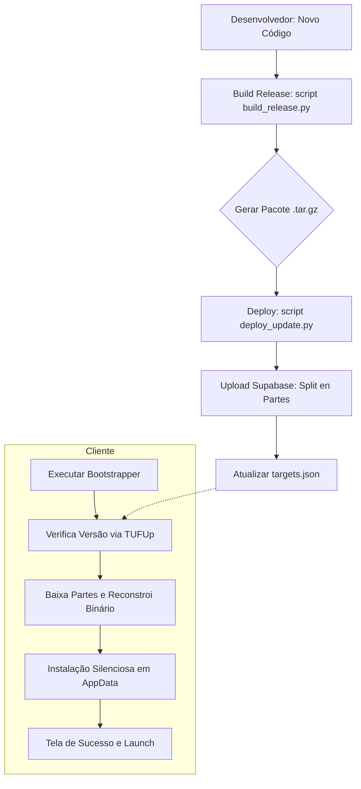

# Manual de Deploy e Distribuição - Estrutural Analyzer

Este documento descreve o fluxo de build, packaging e atualização do sistema **Estrutural Analyzer**.

## 🏗️ Arquitetura de Distribuição

O sistema utiliza um modelo de **Bootstrapper/Launcher** para garantir que o software esteja sempre na versão mais recente.

| Componente | Função |
| :--- | :--- |
| **Bootstrapper (`Estrutural_Analyzer_download_updater.exe`)** | O executável inicial distribuído ao usuário. Ele verifica atualizações, baixa os pacotes da nuvem e lança a aplicação principal. |
| **Main Application (`main.exe`)** | O binário principal do programa, localizado em `AppData/Local/AgenteCAD/app`. |
| **Supabase Cloud Storage** | Hospeda os binários divididos em partes (`.part1`, `.part2`, etc.) para máxima estabilidade no download. |

---

## 🚀 Fluxo de Pipeline (Mermaid)



---

## 🛠️ Scripts e Localização

Todos os scripts estão em `scripts/`.

### 1. Build da Aplicação (`build_release.py`)
Compila o `main.py` e suas dependências.
- **Saída**: Um arquivo `.tar.gz` na pasta `repository/targets/`.
- **Uso**: `python scripts/build_release.py`

### 2. Build do Bootstrapper (`build_bootstrapper_pyinstaller.py`)
Gera o instalador/atualizador visual com interface Premium.
- **Saída**: `dist/Estrutural_Analyzer_download_updater.exe`.
- **Uso**: `python scripts/build_bootstrapper_pyinstaller.py`

### 3. Deploy para Nuvem (`deploy_update.py`)
Faz o upload dos binários e metadados para o Supabase.
- **Funcionalidade**: Automaticamente divide arquivos grandes em partes de 5MB e limpa "partes fantasmas" no servidor.
- **Uso**: `python scripts/deploy_update.py`

---

## 📑 Passo a Passo para Novo Deploy

1.  **Atualizar Versão**: Altere `APP_VERSION` em `src/config.py`.
2.  **Gerar Release**:
    ```bash
    python scripts/build_release.py
    ```
3.  **Deploy na Nuvem**:
    ```bash
    python scripts/deploy_update.py
    ```
4.  **Gerar Novo Bootstrapper** (apenas se mudar a UI do instalador):
    ```bash
    python scripts/build_bootstrapper_pyinstaller.py
    ```

---

## 📦 Estrutura de Pastas (Instalação)

No computador do usuário, o AgenteCAD se instala em:
`%LOCALAPPDATA%/AgenteCAD/`
- `/app`: Contém o `main.exe` e libs.
- `/metadata`: Arquivos de controle do TUF (segurança e versões).
- `AgenteCAD_Launcher.exe`: Cópia do bootstrapper para persistência.

---

## 💡 Dicas de Manutenção
- **Limpeza de Cache**: O atualizador limpa automaticamente downloads antigos em `%TEMP%/AgenteCAD_Update`.
- **Logs**: O log detalhado de cada instalação fica em `%LOCALAPPDATA%/AgenteCAD/updater.log` ou na pasta do executável durante o download.
