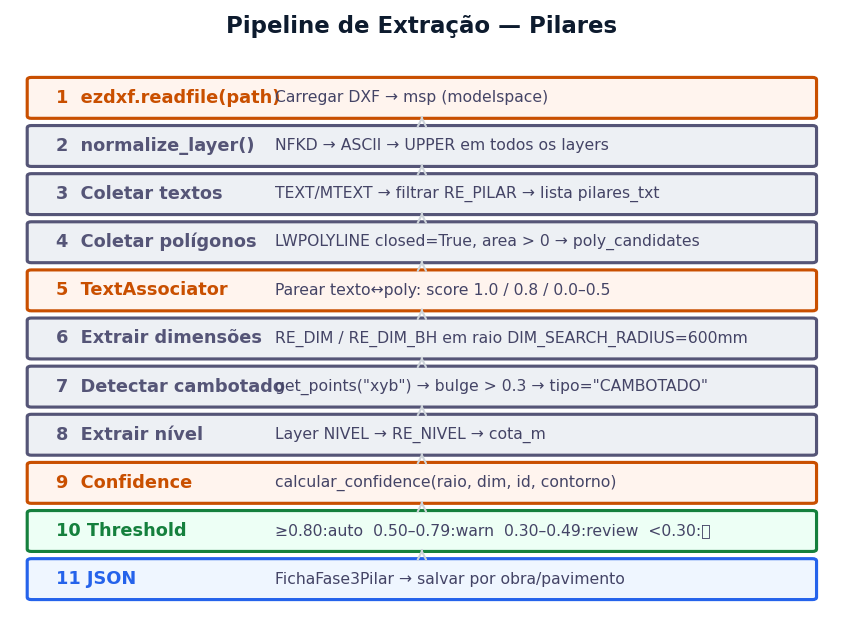
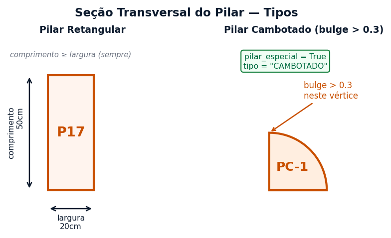
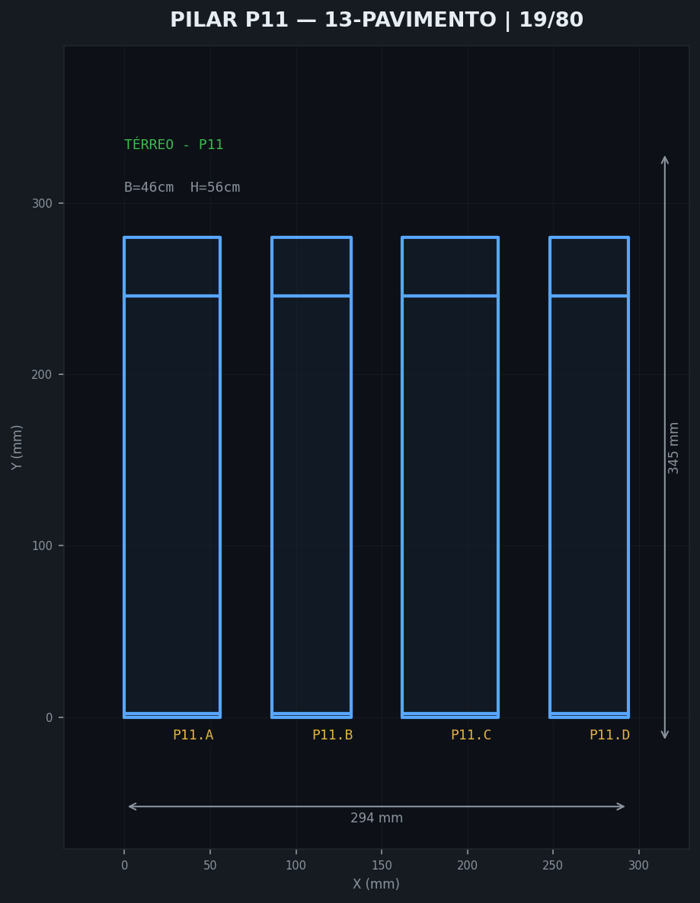
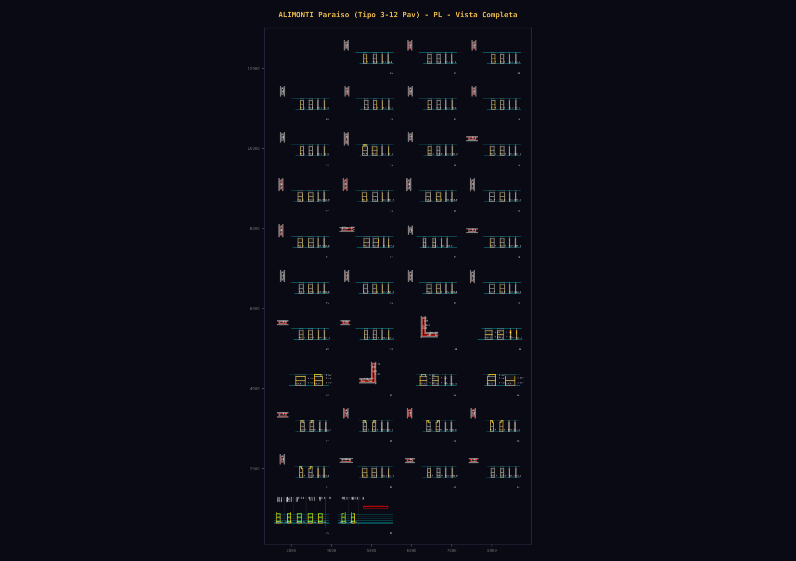
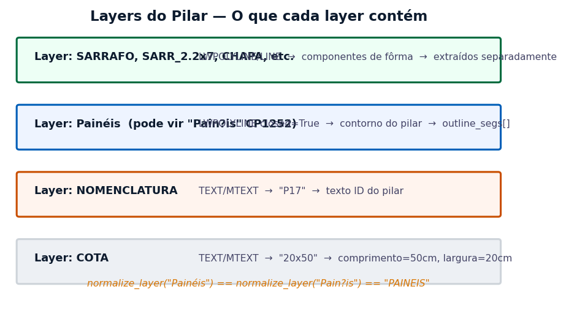
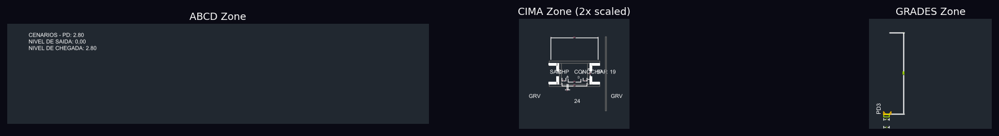

# FICHA DE COMPREENSÃO — BOLT (Robô de Pilares)

**Sistema:** CAD-ANALYZER v2.0
**Robô:** Bolt — Especialista em Pilares (Pilar Robot)
**Responsável:** Fase 6 do Pipeline CAD-ANALYZER (Execução CAD)
**Versão do Documento:** 2.0 | 2026-03-22
**Gerador STOG:** `gerar_pl_dxf_stog.py` (ezdxf, sem AutoCAD)

---

## 1. IDENTIDADE DO ROBÔ

| Atributo | Valor |
|----------|-------|
| **Nome** | Bolt |
| **Função** | Geração de DXF STOG-quality de formas de pilar — CIMA + Faces ABCD + Grades |
| **Escopo** | Pilares retangulares, cambotados e especiais (L/T/U) — até 8 faces (A-H) |
| **Norma** | NBR 7190 (madeira), NBR 14931 (concretagem), NBR 6118 (concreto) |
| **Gerador** | `gerar_pl_dxf_stog.py` (pilares) |
| **JSON Fonte** | `Fase-4_Sincronizacao/JSON_Pilares/P*.json` |

---

## 1.5. POSIÇÃO NO PIPELINE CAD-ANALYZER

```
Fase-1  Ingestão DXF STOG             → DXFs originais (PL, LV, FV, LJ, EVG)
Fase-2  Classificação Elementos        → Identificação P11, P32A, PC-1...
Fase-3  Extração Parâmetros            → extrair_bh_pilares.py → b, h por pilar
Fase-4  Sincronização JSON             → JSON_Pilares/P*.json (faces ABCD)
         ↓
[BOLT ENTRA AQUI]
         ↓
Fase-6  Execução CAD                   → gerar_pl_dxf_stog.py → PL_stog_{ts}.dxf
                                          Preview PNG automático
         ↓
Fase-7  Comparação / Validação         → comparar_bh_stog_vs_gerado.py
```



## 1.6. CONTEXTO ESTRUTURAL — TIPOS DE PILAR





## 1.7. AS 3 ABAS DO ROBÔ (CIMA + ABCD + GRADES)

O robô original gera **3 scripts SCR independentes** por pilar:

| Aba | Diretório SCR | Conteúdo | Status Gerador |
|-----|---------------|----------|----------------|
| **CIMA** | `P1_CIMA/` | Seção transversal (vista de cima do pilar) | ✅ Implementado |
| **ABCD** | `P1_ABCD/` | Faces A/B/C/D (elevação lateral com painéis) | ✅ Implementado |
| **GRADES** | `P1_GRADES/` | Pontaletes + sarrafos + perfis metálicos + furação | ❌ NÃO IMPLEMENTADO |

## 1.8. O QUE SÃO GRADES (Definição Física)

**Grade** = conjunto de **pontaletes metálicos** (tubos de aço) que formam uma cinta ao redor da fôrma do pilar:

```
Componentes físicos:
  PONTALETE         — barra metálica vertical (tubo circular) → sustenta painéis
  MEIO PONTALETE    — pontalete de comprimento reduzido
  Perfil Metálico   — perfil horizontal (gravata) que amarra pontaletes
  Parafusos         — fixam pontaletes entre si e ao perfil (par_1_2 a par_8_9)

Cada pilar pode ter até 3 grades por grupo (2 grupos):
  grade_1, distancia_1    → Grade 1: comprimento pontalete + espaço até grade 2
  grade_2, distancia_2    → Grade 2
  grade_3                 → Grade 3 (última, sem distância)

No DXF STOG, as grades se manifestam como:
  - Blocos INSERT: PONTALETE (176×) e MEIO PONTALETE (226×) — layer Madeira
  - Retângulos: SARR_2.2x7 (931 entities!) — sarrafos verticais/horizontais
  - Retângulos: Perfil Metálico (150×) — gravatas
  - Blocos: GRA-E e GRA-D — triângulos de grade nos cantos
```

## 1.9. JSON PILARES — SCHEMA COMPLETO

```
Campos básicos:    numero, nome, comprimento, largura, altura, pavimento
Níveis:            nivel_chegada, nivel_saida, nivel_diferencial
Modo:              modo_distribuicao ("NOVA" | "INI")

Parafusos:         par_1_2 a par_8_9 (distâncias entre pares de furos)
Grades:            grade_1, distancia_1, grade_2, distancia_2, grade_3
Grades grupo 2:    grade_1_grupo2, distancia_1_grupo2, ..., grade_3_grupo2
Detalhes grade:    detalhe_grade{1-3}_{1-5} + altura_detalhe_{1-3}_{1-5}

Por face (A-H):    h1_X a h5_X (alturas segmentos)
                   larg1_X a larg3_X (larguras painéis)
                   laje_X, posicao_laje_X (passagem de laje)
                   hachura_l{1-3}_h{2-5}_X (tipo hachura por célula)

Aberturas/face:    distancia_esq_1_X, largura_esq_1_X, profundidade_esq_1_X
                   (2 por lado × 2 lados = 4 aberturas por face)

Pilar especial:    pilar_especial_ativo, tipo ("L"|"T"|"U")
                   comp_1/2/3, larg_1/2/3
                   grade_a_1..grade_h_3 (grades por face)
                   par_esp_a_{1-9}..par_esp_h_{1-9}
```

## 1.10. LAYERS STOG REAL vs GERADOR

| Layer STOG Real | Entities | Gerador | Status |
|-----------------|----------|---------|--------|
| `Paineis` | 1689 | ✅ Presente | OK |
| `Hachura` | 528 | ✅ Presente | OK |
| `Madeira` | 504 | ✅ Presente | OK |
| `CHAPA` | 276 | ✅ Presente | OK |
| `Perfil Metalico` | 150 | ✅ Presente | OK |
| `SARRAFO` | 302 | ✅ Presente | OK |
| `COTA` | 1502 | ✅ Presente | OK |
| `Nivel` | 74 | ✅ Presente | OK |
| **`SARR_2.2x7`** | **931** | ❌ Ausente | **FALTA — crítico** |
| `SARR_2.2x10` | 48 | ❌ Ausente | FALTA |
| `SARR_3.5x7` | 33 | ❌ Ausente | FALTA |
| `SARR_7x7` | 34 | ❌ Ausente | FALTA |
| `MEIO_PONT` | 59 | ❌ Ausente | FALTA |
| `NOMENCLATURA` | 64 | ✅ Presente (Sprint 1) | OK |
| `Texto Secao` | 181 | ✅ Presente (Sprint 1) | OK |
| `COTAS FURACAO` | (layer exists) | ✅ Presente (Sprint 3) | OK — cruzes (+) nos pontaletes |
| `NIVEL 1/2 PAV` | 37-116 | ❌ Ausente | FALTA (Sprint 4) |

> **Progresso:** 10 de 13 layers implementados. Restam 3: MEIO_PONT, NIVEL 1/2 PAV, BARRA ANCORAGEM.

## 1.11. BLOCOS INSERT DO STOG REAL (ausentes no gerador)

| Bloco | Qtd | Composição | Descrição |
|-------|-----|-----------|-----------|
| `C` | 240 | 81 LINE + 13 ARC | Hachura de concreto |
| `PONTALETE` | 176 | 1 POLY + 3 ARC + 3 LINE | Pontalete completo (tubo circular) |
| `MEIO PONTALETE` | 226 | 1 POLY + 3 ARC + 3 LINE | Meio pontalete |
| `titulo1` | 35 | 3 ATTDEF + 1 LINE | Título com atributos dinâmicos |
| `GRA-E / GRA-D` | -- | Triângulos | Grade esquerda/direita |

> O gerador NÃO cria blocos INSERT — usa apenas primitivas (LWPOLYLINE, HATCH, MTEXT).



---

## 2. O QUE BOLT PROCESSA

### Entrada (INPUT)

Bolt recebe uma **ficha de pilar** com os seguintes campos obrigatórios:

```
Pilar_name        — Nome do pilar (ex: P1, P32A)
Pilar_dim         — Dimensão da seção (ex: (19x229), (30x188))
Pilar_pilar_segs  — Fonte das linhas (Entidade CAD | Geometria Automática)
Pilar_p_sA_l1_n   — Nome da laje lado A, nível 1 (ex: L26)
Pilar_p_sA_l1_h   — Altura da laje lado A, nível 1 (ex: 15cm)
Pilar_p_sA_l2_n   — Nome da laje lado A, nível 2 (ex: L31)
Pilar_p_sA_l2_h   — Altura da laje lado A, nível 2
Pilar_p_sB_l1_n   — Nome da laje lado B, nível 1 (ex: L30)
Pilar_p_sB_l1_h   — Altura da laje lado B, nível 1
```

### Processamento (ENGINE)

Bolt usa o **StructuralVectorizer** + **TransformationEngine** para:

1. **Leitura de geometria**: Extrai contornos do pilar do DXF de entrada (layer CONCRETO ou 0)
2. **Detecção de template**: Verifica qual template ABCD usar (Padrão, ROCONTEC, PATRIARCA, UNI5, NOVA, INIFORMAS, INIFORMAS2, INI)
3. **Cálculo de painéis**: Determina quantos painéis (compensado resinado) envolvem o pilar
4. **Posicionamento de sarrafos**: Calcula espaçamento de sarrafos (AB e CDEFGH) por dimensão
5. **Geração de DXF**: Desenha a forma completa com todas as views (frontal, seção transversal, corte)

### Saída (OUTPUT)

```
pilares_{obra}_{pavimento}.dxf  — DXF com todas as formas de pilar do pavimento
```

Camadas geradas no DXF de saída:
- `Painéis` — Faces de compensado (vermelho/branco por reaproveitamento)
- `CONCRETO` — Projeção do concreto do pilar
- `COTA` / `COTA_H` — Cotas de dimensão
- `Madeira` — Elementos de madeira (berços, cunhas)
- `HACHURA MADEIRAS` — Hachuramento dos perfis de madeira
- `NOMENCLATURA` — Identificação do pilar e número da forma

---

## 3. TEMPLATES ABCD (8 VARIANTES)

| Template | Parafuso | Linha | Usado Por |
|----------|----------|-------|-----------|
| **Padrão (2)** | PAR_ESQ | PLINE | Maioria das obras |
| **ROCONTEC** | PAR_DIRV | MLINE | Obras Rocontec |
| **PATRIARCA** | PAR_ESQ | PLINE | Obras Patriarca |
| **UNI5** | PAR_ESQ | PLINE | Sistema UNI5 |
| **NOVA** | PAR_ESQ (parafuso-only) | PLINE | Novo formato |
| **INIFORMAS** | INI_PAR | MLINE | Sistema Iniformas |
| **INIFORMAS2** | INI_PAR2 | MLINE | Variante Iniformas |
| **INI** | INI_PAR (parafuso-only) | PLINE | Formato INI |

### Dimensões Padrão por Template

```
altura_h1:      Altura total da forma (cm)
max_altura_ab:  Altura máxima do painel AB
max_altura_cd:  Altura máxima do painel CD
max_largura_ab: Largura máxima do painel AB
max_largura_cd: Largura máxima do painel CD
min_abertura_normal:   Abertura mínima normal
min_abertura_pequena:  Abertura mínima para pilares pequenos
```

---

## 4. MODELO DE DADOS (SQLITE)

### Tabela `pillars` em `project_data.vision`

```sql
id               TEXT  PRIMARY KEY
project_id       TEXT  — FK para projects
name             TEXT  — Nome do pilar (P1, P32A...)
type             TEXT  — Tipo de seção
area             REAL  — Área da seção (mm²)
points_json      TEXT  — Vértices do polígono de seção
sides_data_json  TEXT  — Dados de cada face (AB, CD)
links_json       TEXT  — Conexões com vigas/lajes adjacentes
conf_map_json    TEXT  — Mapa de confiança por campo
validated_fields_json  TEXT  — Campos validados pelo usuário
na_fields_json   TEXT  — Campos marcados como N/A
issues_json      TEXT  — Problemas detectados
is_validated     BOOLEAN
pkl_path         TEXT  — Cache serializado
```

### Regras de Transformação Ativas (Bolt)

| Campo | Acurácia | Status | Tipo |
|-------|----------|--------|------|
| Pilar_pilar_segs | 85.4% | ✅ PRODUÇÃO | Classificação (Entidade CAD vs Geometria) |
| Pilar_name | 32.8% | ⚠️ BAIXA | Nome (projeto-específico, difícil generalizar) |
| Pilar_dim | 29.1% | ⚠️ BAIXA | Dimensão (muitas variantes por projeto) |
| Pilar_p_sA_l1_n | 100% | ✅ PRODUÇÃO | Nome da laje (único valor no dataset) |
| Pilar_p_sA_l1_h | 100% | ✅ PRODUÇÃO | Altura da laje (único valor) |
| Pilar_p_sA_l2_n | 100% | ✅ PRODUÇÃO | Nome da laje (único valor) |
| Pilar_p_sA_l2_h | 100% | ✅ PRODUÇÃO | Altura da laje (único valor) |
| Pilar_p_sB_l1_n | 100% | ✅ PRODUÇÃO | Nome da laje (único valor) |
| Pilar_p_sB_l1_h | 100% | ✅ PRODUÇÃO | Altura da laje (único valor) |

**Nota sobre Pilar_name e Pilar_dim:** A acurácia baixa se deve ao fato de que os nomes de pilares são
específicos de cada projeto. Bolt depende da validação humana (Serra + Mestre) para esses campos.

---



## 5. SEMÂNTICA — O QUE É UM PILAR NO DXF

```
┌─────────────────────────────────────────────────────┐
│  O pilar no DXF aparece como:                       │
│                                                     │
│  1. POLILINHA FECHADA no layer CONCRETO ou '0'      │
│     → Contorno da seção transversal                 │
│     → Normalmente retangular (30x188mm, 19x229mm)   │
│                                                     │
│  2. TEXTO próximo com nome "P{N}" e dimensão        │
│     → P1 ou P1(19x229) ou P32A                      │
│     → Layer: NOMENCLATURA, TEXTO ou '0'             │
│                                                     │
│  3. HACHURA ou SOLID no interior                    │
│     → Indica área de concreto (família TQS)         │
│                                                     │
│  IDENTIFICAÇÃO AUTOMÁTICA:                          │
│    - bbox quadrada ou levemente retangular           │
│    - área ~500 a 5000 mm²                           │
│    - aspect_ratio < 3.0                             │
│    - texto próximo começa com "P"                   │
└─────────────────────────────────────────────────────┘
```

---

## 6. PIPELINE DE EXECUÇÃO DO BOLT

```
DXF de Entrada
    ↓
[1] DXFIngestor
    → Detecta familia (TQS/BIM)
    → Extrai RawEntity (polylines, textos)
    ↓
[2] StructuralVectorizer
    → Classifica: Pilar (aspect_ratio < 3, bbox fechada)
    → Gera FeatureVector 8-dim
    → DNA key: "area,0,n_verts,1.0,layer_hash,0,0,1"
    ↓
[3] TransformationEngine (transformation_rules lookup)
    → Prediz: name, dim, pilar_segs
    → Se DNA match: usa dna_frequency_map (alta precisão)
    → Se sem match: usa global_default (fallback)
    ↓
[4] REVISÃO HUMANA (Serra + Mestre)
    → Valida nome, dimensão, lajes adjacentes
    → Registra em training_events (melhora futuras regras)
    ↓
[5] Bolt gera DXF de forma
    → Seleciona template ABCD correto
    → Calcula painéis, sarrafos, cotas
    → Exporta DXF final
```

---


## 7. COMANDO DE GERAÇÃO PL

```bash
# Geração PL STOG (todos os pilares de uma obra)
python scripts/gerar_pl_dxf_stog.py \
  --obra D:/Agente-cad-PYSIDE/DADOS-OBRAS/Obra_TREINO_1

# Limitar pilares (debug rápido)
python scripts/gerar_pl_dxf_stog.py \
  --obra D:/Agente-cad-PYSIDE/DADOS-OBRAS/Obra_TREINO_1 \
  --max 5

# Output: Fase-6_Execucao_CAD/PL_stog_{timestamp}.dxf
#         Fase-6_Execucao_CAD/PL_stog_quality.png
```



---

## 8. GAPS CRÍTICOS: GERADOR vs STOG REAL

| # | Gap | Impacto | Status |
|---|-----|---------|--------|
| G1 | **Aba GRADES** | CRÍTICO | ✅ IMPLEMENTADO Sprint 2 — blocos INSERT + SARR_2.2x7 + grades básicas |
| G2 | **Blocos PONTALETE** | CRÍTICO | ✅ IMPLEMENTADO Sprint 2 — 7 entities (POLY+ARC+LINE) replicadas do STOG |
| G3 | **Layers tipados sarrafo** | ALTO | ✅ IMPLEMENTADO Sprint 1 — 4 layers SARR distintos |
| G4 | **COTAS FURAÇÃO** | ALTO | ✅ IMPLEMENTADO Sprint 3 — cruzes (+) via par_1_2..par_8_9 |
| G5 | **Detalhes de grade** | ALTO | ⚠️ PARCIAL — lógica básica, falta ler detalhe_grade{1-3}_{1-5} completos |
| G6 | **NOMENCLATURA** | MÉDIO | ✅ IMPLEMENTADO Sprint 1 — 21 texts |
| G7 | **Nível Pavimento** | MÉDIO | ⚠️ PENDENTE Sprint 4 |
| G8 | **LEADER entities** | MÉDIO | ⚠️ PENDENTE Sprint 4 |
| G9 | **Faces E-H** | BAIXO | ⚠️ PENDENTE Sprint 4 |
| G10 | **Ingestão grades** | BAIXO | ✅ IMPLEMENTADO Sprint 3 — `extrair_grades_pl.py` extrai de 7 DXFs STOG |

---

## 9. PROBLEMAS CONHECIDOS E LIMITAÇÕES

| Problema | Causa | Mitigação |
|----------|-------|-----------|
| Pilar_name acurácia 32.8% | Nomes são projeto-específicos | Validação humana obrigatória |
| Pilar_dim acurácia 29.1% | Muitas dimensões diferentes | TransformationEngine DNA por obra |
| Pilares sobrepostos no DXF | Projetos com pilares-parede | Merge de contornos adjacentes |
| Layer '0' vs CONCRETO | Arquivos TQS usam layer '0' | FamilyDetector identifica automaticamente |

---

## 8. MÉTRICAS DE PERFORMANCE (2026-03-18)

```
Total de pilares no banco:  6.524
Pilares validados:          ~3.800 (~58%)
training_events (Pilar):    189 eventos de validação
Regras de transformação:    9 regras (7 em produção)
Acurácia média das regras:  71.4%
Cobertura média:            3.8%
```

---

*Ficha técnica Bolt v3.0 | CAD-ANALYZER | Diana Corporação Senciente*
*Atualizada em 2026-03-22 | v3: Grades, furação, JSON schema completo, 13 layers ausentes, 10 gaps, blocos INSERT*
