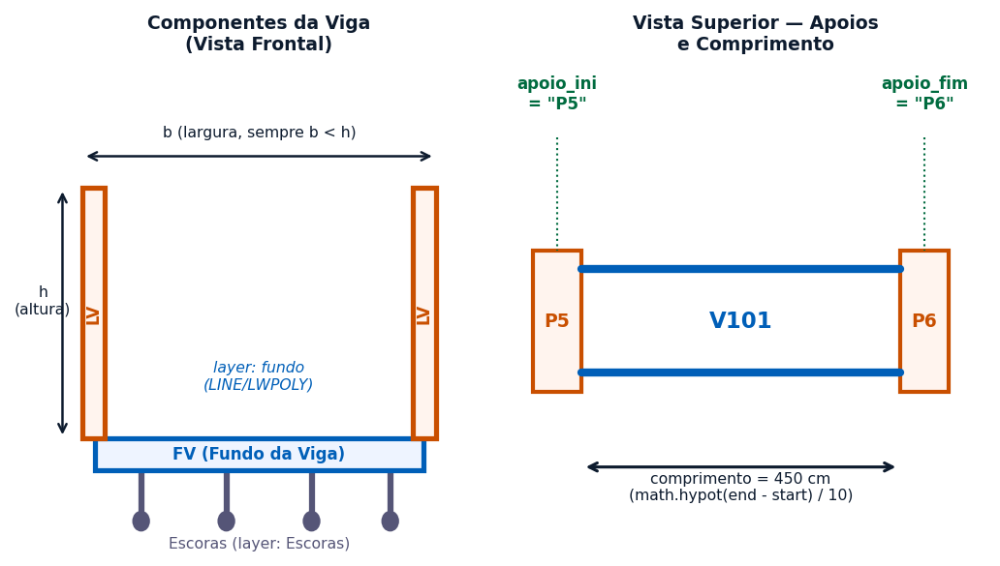
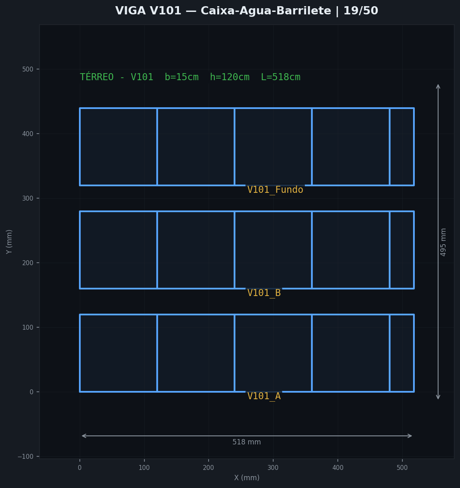
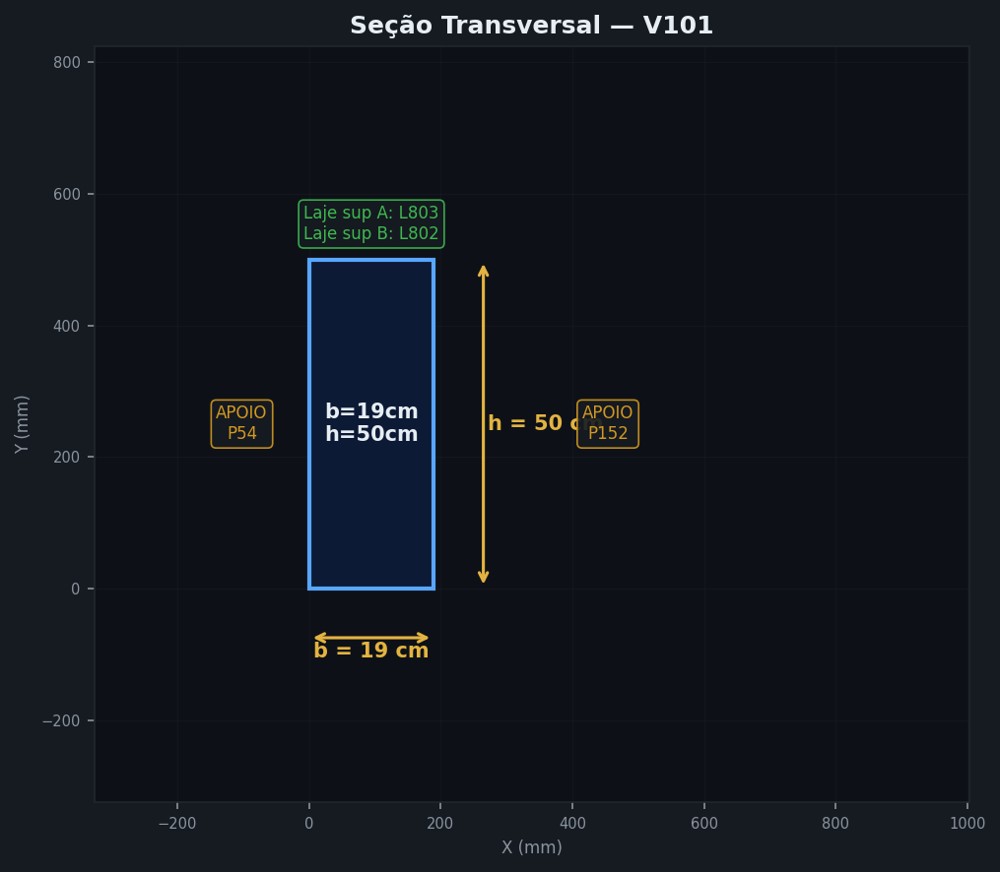
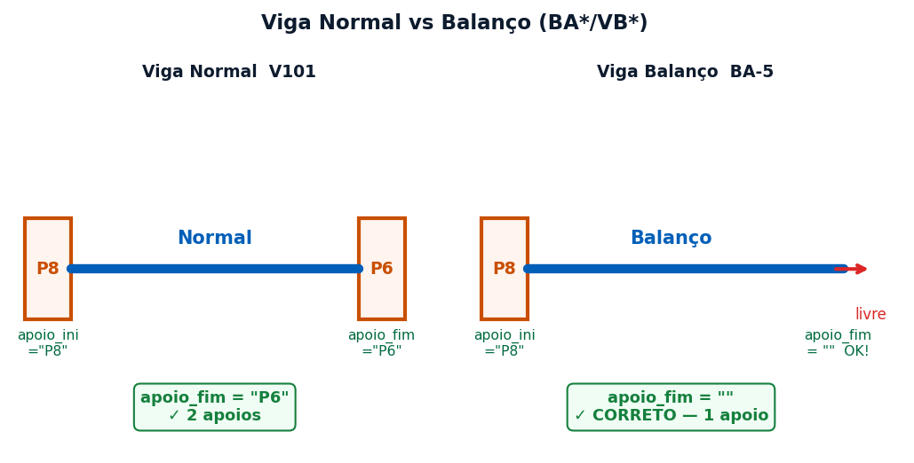
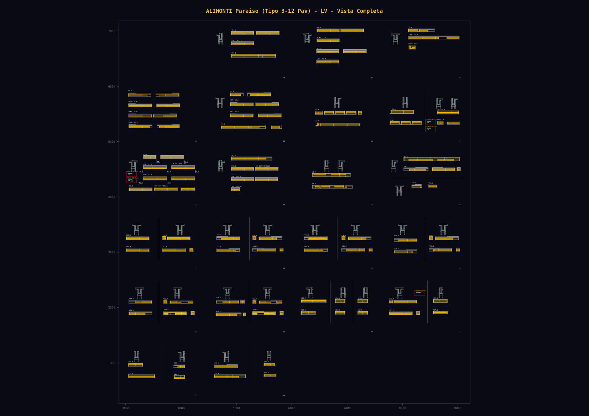
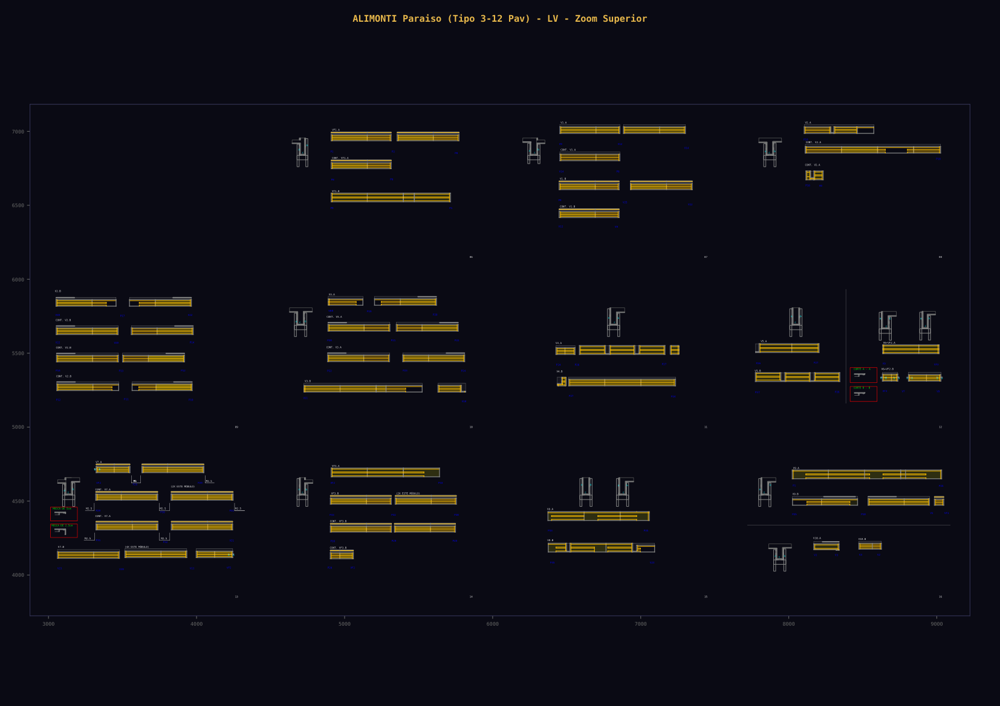
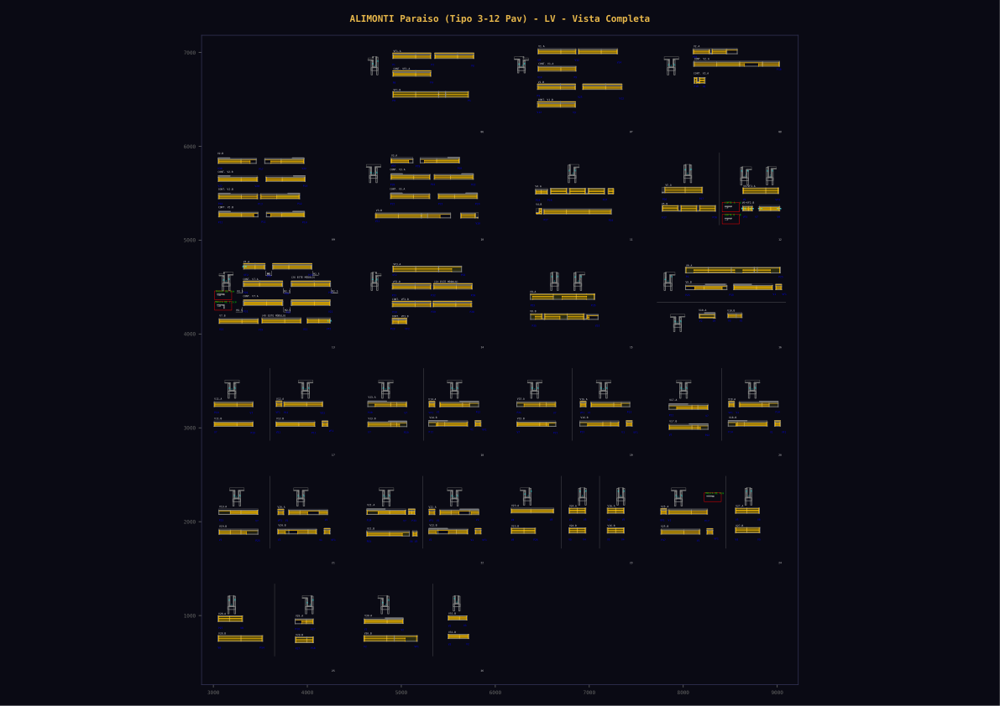
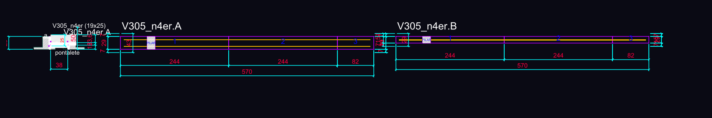
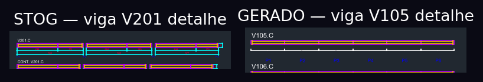
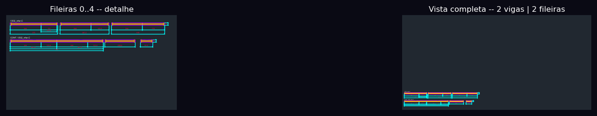

# FICHA DE COMPREENSÃO — CRANE (Robô de Vigas)

**Sistema:** CAD-ANALYZER v2.0
**Robô:** Crane — Especialista em Vigas Laterais (LV) e Fundos de Viga (FV)
**Responsável:** Fase 6 do Pipeline CAD-ANALYZER (Execução CAD)
**Versão do Documento:** 3.1 | 2026-03-20

---

## 1. IDENTIDADE DO ROBÔ

| Atributo | Valor |
|----------|-------|
| **Nome** | Crane |
| **Função** | Geração de DXF STOG-quality de formas de viga — faces laterais (LV) e fundos (FV) |
| **Escopo** | Vigas de concreto armado — Face A / Face B / Seção Transversal / Garfos / Grade |
| **Norma** | NBR 14931 (concretagem), NBR 7190 (madeira), NBR 6118 (concreto estrutural) |
| **Geradores** | `gerar_lv_dxf_stog.py` (laterais) · `gerar_fv_dxf_stog.py` (fundos) |
| **JSON Fonte LV** | `Fase-4_Sincronizacao/JSON_Vigas_Laterais/V*_{A|B}.json` |
| **JSON Fonte FV** | `Fase-4_Sincronizacao/JSON_Vigas_Fundo/V*_fundo.json` |
| **Parâmetros Globais** | `Fase-4_Sincronizacao/vigas_salvas.json` (b, h, comprimento) |

---

## 1.5. POSIÇÃO NO PIPELINE CAD-ANALYZER

```
Fase-1  Ingestão DXF STOG             → DXFs originais (LV, FV, PL, LJ, EVG)
Fase-2  Classificação Elementos        → Identificação V101, P11, L101…
Fase-3  Extração Parâmetros            → extrair_parametros_viga.py → b, h, L por viga
Fase-4  Sincronização JSON             → JSON_Vigas_Laterais/ + JSON_Vigas_Fundo/
                                          vigas_salvas.json   (b, h, comp consolidados)
                                          extrair_garfos_evg.py → garfos_*.json
         ↓
[CRANE ENTRA AQUI]
         ↓
Fase-6  Execução CAD                   → gerar_lv_dxf_stog.py → LV_stog_{ts}.dxf
                                          gerar_fv_dxf_stog.py → FV_stog_{ts}.dxf
                                          Preview PNG automático
         ↓
Fase-7  Comparação / Validação         → comparar_dxf.py → _relatorio_comparacao.json
```

> **Atenção:** o gerador LV/FV é chamado diretamente da Fase-6. Não há Fase-5 para vigas — o Crane lê JSON Fase-4 e gera DXF Fase-6 diretamente.

---

## 2. CONTEXTO ESTRUTURAL — A VIGA NO PROJETO

### 2.1 Componentes Físicos da Viga

Uma viga de concreto armado gera 3 elementos de fôrma independentes:

| Componente | Sigla | Gerador | Orientação |
|-----------|-------|---------|------------|
| Face lateral esquerda | LV (lado A) | `gerar_lv_dxf_stog.py` | Vertical — h_A = h_section + 4 |
| Face lateral direita | LV (lado B) | `gerar_lv_dxf_stog.py` | Vertical — h_B = max(h_section-10, 10) |
| Fundo da viga | FV (tipo C) | `gerar_fv_dxf_stog.py` | Horizontal — largura = b |
| Garfos metálicos | EVG | `extrair_garfos_evg.py` | Abraça LV+FV — conta por viga |



### 2.2 Parâmetros Estruturais → Fôrma

```
Projeto Estrutural:       b = 19cm     h = 50cm    L = 518cm
                          ↓                ↓             ↓
Fôrma (fundo):        largura FV = b    —      comprimento = L
Fôrma (lateral A):    altura h_A = h/2 + 4    comprimento = L
Fôrma (lateral B):    altura h_B = h/2 - 10   comprimento = L
```

### 2.3 Ficha Estrutural do Elemento (Visão Interna do CAD-ANALYZER)





### 2.4 Viga Normal vs Balanço

```
Viga Normal: apoio_ini="P8" + apoio_fim="P6"  →  2 pilares de apoio
Viga Balanço (BA*/VB*): apoio_ini="P8" + apoio_fim=""  →  1 pilar (livre na ponta)
```



---

## 3. ARQUITETURA DO GERADOR LV STOG

### vigas_salvas.json — Origem e Papel

```json
// Gerado por: gerar_obras_salvas.py  (consolida Fases 3+4)
// Leitura: extrair_parametros_viga.py → medições reais do DXF STOG original
// Conteúdo:
{
  "V101": { "b": 15.0, "h": 120.0, "comprimento": 518.0 },
  "V102": { "b": 15.0, "h": 120.0, "comprimento": 336.6 }
}
// b = largura da alma/flange (cm) — dimensão física da viga
// h = altura total da fôrma (cm) — h_section = h/2 → h_A = h/2+4, h_B = max(h/2-10,10)
// comprimento = medido pelo math.hypot(end - start)/10 no DXF estrutural
```

### Fluxo de Dados

```
JSON_Vigas_Laterais/V{n}_A.json + V{n}_B.json
    ↓
vigas_salvas.json  →  b (largura alma), h (altura total fôrma), comprimento real
    ↓
extract_panels_from_json()  →  panel dicts [{width, height1, height2,
                                             grade_h1, grade_h2, laje_central_alt}]
    ↓
draw_viga_lateral():
    ├── draw_section_detail()   →  seção transversal (esq)
    ├── draw_lv_face() Face A   →  face A (direita da seção)
    └── draw_lv_face() Face B   →  face B (à direita de A + GAP_AB=50cm)
    ↓
Fase-6_Execucao_CAD/LV_stog_{timestamp}.dxf
```

### Fórmulas de Altura

```
h_raw     = vigas_salvas[viga]['h']    # altura total fôrma (cm)
h_section = h_raw / 2.0               # altura concreto da seção
h_A       = h_section + 4             # painel Face A (maior — lado laje)
h_B       = max(h_section - 10, 10)   # painel Face B (menor — lado web)
```

### Laje Superior e Inferior (SCO-___-LAJ)

As lajas sup/inf são **extensões fixas da fôrma** além do painel principal — encaixam nas vigas vizinhas e no fundo da laje. São elementos obrigatórios em todo painel LV.

```
laje_sup = 7.0 cm  (default fixo — extensão acima do painel, lado laje)
laje_inf = 7.0 cm  (default fixo — extensão abaixo do painel, side fundo)

Posição no DXF (layer SCO-___-LAJ):
  Laje Inf: retângulo [x_cur, y0-7] → [x_cur+pw, y0]        (abaixo do painel)
  Laje Sup: retângulo [x_cur, y0+h] → [x_cur+pw, y0+h+7]    (acima do painel)
  Laje Cen: retângulo na zona laje_central_alt se lca > 0     (dentro do painel)

NOMENCLATURA (V101.A) posicionada em: y0 + h_A + laje_sup + NOM_ABOVE
Cota vertical total: h_A + laje_inf + laje_sup (via dim_h_lateral)
```



---

## 4. JSON FASE-4 — SCHEMA COMPLETO (LV)

```json
{
  "number": "101",
  "name": "V101_A",
  "floor": "TÉRREO",
  "side": "A",
  "total_width": 15.0,        // b_alma — espessura da viga (alma)
  "total_height": "120.0",    // comprimento do painel (cm) — NÃO é a altura
  "laje_central_alt": 15.0,   // (opcional) laje central global — "dois níveis"

  "panels": [
    {
      "width": 120.0,         // comprimento do painel (cm)
      "height1": 30.0,        // altura seção inferior (cm)
      "height2": 30.0,        // altura seção superior (cm) — 0 se painel simples
      "grade_h1": "0",        // altura da grade na zona h1 (0 = sarrafeado normal)
      "grade_h2": "0",        // altura da grade na zona h2
      "laje_central_alt": 15.0  // (opcional) override por painel
    }
  ],

  "holes": [                  // 4 posições fixas [ET, EF, DT, DF]
    {"active": false, "width": 0.0, "height": 0.0, "position": 0.0},
    {"active": false, "width": 0.0, "height": 0.0, "position": 0.0},
    {"active": false, "width": 0.0, "height": 0.0, "position": 0.0},
    {"active": false, "width": 0.0, "height": 0.0, "position": 0.0}
  ],
  // holes índices: 0=topo-esq (ET), 1=fundo-esq (EF), 2=topo-dir (DT), 3=fundo-dir (DF)

  "pillar_left":  {"active": false, "width": 0.0, "length": 0.0},
  "pillar_right": {"active": false, "width": 0.0, "length": 0.0},

  "sarrafo_left_id": 0,
  "sarrafo_right_id": 0
}
```

---

## 5. TIPOS DE GEOMETRIA SUPORTADOS (LV)

### 4.1 Painel Simples (Sarrafeado)
```
height1 > 0, height2 = 0, grade_h1 = 0, laje_central_alt = 0
→ Painel retangular (width × h_A) com sarrafos SARR_3.5x7 verticais
```

### 4.2 Grade (Pontalete)
```
grade_h1 > 0 (ex: 50)
→ Painel com retângulo grade na zona inferior + barras verticais ao longo
  (SARR_2.2x7 horizontal + SARR_3.5x7 pernas verticais)
```

### 4.3 Dois Níveis (Laje Central)
```
laje_central_alt > 0 (JSON root ou por painel)  +  height1 > 0  +  height2 > 0
→ Painel dividido: [Zona h1] + [Laje Central SCO-___-LAJ] + [Zona h2]
   Escala proporcional: _s = h_A / (h1 + lc + h2) se total > h_A
```

### 4.4 Aberturas (Holes)
```
holes[i].active = true, width > 0, height > 0, position > 0
→ Retângulo DASHED (layer Painéis) + hachura ANSI31 (COTA) + texto "WxH"
   Posicionamento por índice: ET(topo-esq), EF(fundo-esq), DT(topo-dir), DF(fundo-dir)
```

### 4.5 Pilar / Obstáculo
```
pillar_left.active = true  →  RECTANGLE na borda esquerda da face
pillar_right.active = true →  RECTANGLE na borda direita da face
→ Hachura ANSI31 + label "PILAR"
   Posição: x0 + pillar.length,  altura = h_A inteiro
```



---

## 6. LAYERS STOG LV (Vigas Laterais)

| Layer | Cor ACI | Conteúdo | Prioridade |
|-------|---------|----------|------------|
| `Painéis` | 200 | 4 LINE entities por painel (bordas), aberturas DASHED | CRÍTICA |
| `Reaproveitamento` | 251 | ANSI31 hatch scale=1.0 cobrindo todo painel — padrão visual STOG | CRÍTICA |
| `SARR_3.5x7` | 81 | Sarrafos verticais duplos (pares inset=15 + divisores) | ALTA |
| `SARR_2.2x7` | 40 | Sarrafos simples + horizontais de grade | ALTA |
| `SCO-___-LAJ` | 224 | Laje superior, inferior e central (LWPOLYLINE + ANSI31 hatch) | ALTA |
| `CONCRETO` | 251 | Polígono L da seção transversal | ALTA |
| `Madeira` | 126 | Boards externos da seção (9 LWPOLYLINEs) | ALTA |
| `barrote` | 126 | Barrote horizontal base da seção | ALTA |
| `presilha` | 224 | Presilhas na seção transversal | MÉDIA |
| `TENSOR` | 224 | Tensor holders na seção transversal | MÉDIA |
| `COTA` | 241 | Dimensões (ANSI31 concreto seção, cotas horizontais/verticais faces) | MÉDIA |
| `Cota Seção (2x)` | 241 | Cota de altura do concreto na seção (texto 2× maior) | MÉDIA |
| `NOMENCLATURA` | 7 | Labels das faces (V101.A, V101.B) acima do painel | MÉDIA |
| `5` | 5 (ciano) | Textos internos de aberturas e labels de painéis | BAIXA |
| `texto` | 7 | MTEXT ponteiros (N 1/2pont) | BAIXA |
| `Folhas` | 255 | Bordas das folhas (1485×1050) | BAIXA |
| `CARIMBO` | 255 | Texto do carimbo inferior | BAIXA |

---

## 7. ANATOMIA DO DXF LV (Layout por Viga)

```
┌─────────────────────────────────────────────────────────────────────────────────┐
│  UMA VIGA NO DXF STOG LV:                                                       │
│                                                                                  │
│  [Seção Transversal]  SECT_GAP=30  [Face A]  GAP_AB=50  [Face B]               │
│                                                                                  │
│  Seção (x_sect_center):                                                         │
│  ┌──────────────┐                                                                │
│  │ barrote      │  ← base (layer barrote)                                       │
│  │ SCO strip    │  ← tira topo barrote (SCO-___-LAJ)                           │
│  │ Madeira L    │  ← board esq 14cm×(h+8) [Madeira]                           │
│  │ Madeira R    │  ← board dir 14cm×max(h-20,h*0.3) [Madeira]                 │
│  │ Painéis L    │  ← 4cm×(h+8) [Painéis]                                      │
│  │ Painéis R    │  ← 4cm×max(h-20,h*0.3) [Painéis]                            │
│  │ Concreto L   │  ← polígono 6 pts + ANSI31 hatch 0.4 [CONCRETO/COTA]       │
│  │ Tensores     │  ← 4 holders [TENSOR]                                         │
│  │ Presilhas    │  ← 2 presilhas [presilha]                                    │
│  │ Labels a/b/c │  ← 3 textos [Texto Seção]                                    │
│  │ 6 dimensões  │  ← h_left, h_concrete, h_right, flange, web width [COTA]    │
│  └──────────────┘                                                                │
│                                                                                  │
│  Face A (h_A = h_section + 4):                                                  │
│  ┌──────────────────────────────────┐                                            │
│  │ Laje Sup (SCO-___-LAJ + ANSI31) │  ← y0+h_A a y0+h_A+laje_sup             │
│  │ ┌──────────────────────────────┐│                                            │
│  │ │  ANSI31 (Reaproveitamento)   ││  ← cobre todo painel width×h_A           │
│  │ │  4 LINE borders (Painéis)    ││                                            │
│  │ │  SARR_3.5x7 verticais        ││                                            │
│  │ │  [Laje Central se lca>0]     ││                                            │
│  │ │  [Grade se grade_h1>0]       ││                                            │
│  │ │  [Abertura DASHED se hole]   ││                                            │
│  │ │  Panel ID + comprimento      ││  ← textos internos                        │
│  │ └──────────────────────────────┘│                                            │
│  │ Laje Inf (SCO-___-LAJ + ANSI31) │  ← y0-laje_inf a y0                      │
│  │ NOMENCLATURA (V101.A)            │  ← y0+h_A+laje_sup+9                    │
│  │ Cotas H individuais (PAINEL dim) │  ← y0-37                                 │
│  │ Cota H total (dim completo)      │  ← y0-60                                 │
│  │ Cotas V (Laje Inf+h1+lc+h2+Sup) │  ← esq, dim_h_right=28                 │
│  └──────────────────────────────────┘                                            │
│                                                                                  │
│  Idêntico para Face B (h_B = max(h_section-10, 10))                            │
└─────────────────────────────────────────────────────────────────────────────────┘
```



---

## 8. SARR_3.5x7 — PADRÃO VERTICAL (Eng. Reversa NIK SUNSET)

```
Para cada face, draw_sarr_lv() adiciona:
  Posições dos pares (cada par = 2 linhas verticais altura h + conector bottom):
    ├── Borda esq:  [inset=15, inset+3.5]
    ├── Por divisor: [div-3.5, div] e [div, div+3.5]   (antes e depois de cada divisão)
    └── Borda dir:  [L-18.5, L-15]
  Altura par outer:  0 a h        (full height)
  Altura par inner:  0 a h-2.2   (com conector horizontal em y=h-2.2)
```

---

## 9. COMANDO DE GERAÇÃO LV

```bash
# Geração LV STOG (todas as vigas de uma obra)
python scripts/gerar_lv_dxf_stog.py \
  --obra D:/Agente-cad-PYSIDE/DADOS-OBRAS/Obra_TREINO_1

# Limitar vigas (para debug rápido)
python scripts/gerar_lv_dxf_stog.py \
  --obra D:/Agente-cad-PYSIDE/DADOS-OBRAS/Obra_TREINO_1 \
  --max 5

# Injetar dados de simulação (aberturas + pilares + dois-níveis)
python scripts/gerar_lv_dxf_stog.py \
  --obra D:/Agente-cad-PYSIDE/DADOS-OBRAS/Obra_TREINO_1 \
  --simulate

# Output: Fase-6_Execucao_CAD/LV_stog_{timestamp}.dxf
#         Fase-6_Execucao_CAD/LV_stog_quality.png  (preview)
```



---

## 10. ORDENAÇÃO DAS VIGAS NO DXF (LV)

```python
# Critério: b desc (flange maior) → comprimento desc
vigas.sort(key=lambda v: (-v['b'], -v['comp']))
# Vigas empilhadas de cima para baixo
# Gap entre linhas: GAP_ROW_LV = 100cm
```

---

## 11. FUNDOS DE VIGA (FV) — `gerar_fv_dxf_stog.py`

### 11.1 Diferença Fundamental LV × FV

| Aspecto | LV (Face Lateral) | FV (Fundo) |
|---------|-------------------|------------|
| Orientação | Vertical (plano da face da viga) | Horizontal (vista superior do fundo) |
| Dimensão chave | h (altura da fôrma) | b (largura da alma) |
| Módulo de painel | Por JSON Fase-4 | 244cm fixo (módulo STOG) |
| Sarrafo | SARR_3.5x7 vertical | SARR_2.2x7 horizontal (padrão b) |
| Nome no DXF | V101.A / V101.B | V101.C |
| JSON fonte | `JSON_Vigas_Laterais/V*_{A|B}.json` | `JSON_Vigas_Fundo/V*_C.json` |

### 11.1.5 JSON Fase-4 FV — Schema Completo (`JSON_Vigas_Fundo/V*_fundo.json`)

```json
{
  "number": "101",
  "name": "V101_A",        // ⚠️ nome herdado do LV — o FV usa como referência
  "floor": "TÉRREO",
  "side": "A",             // ignorado pelo gerador FV — sempre gera .C
  "total_width": 15.0,     // b da viga (cm) — largura do fundo
  "total_height": "120.0", // comprimento total (cm) — gerador usa sum(panels.width)

  "panels": [              // subdivisão do comprimento (preservada — gerador recalcula)
    {
      "width": 120.0,      // comprimento do segmento (cm)
      "height1": 120.0,    // espelhado do LV — ignorado pelo gerador FV
      "height2": 120.0,
      "grade_h1": "0",
      "grade_h2": "0"
    }
  ],

  "holes": [               // 4 posições fixas [ET, EF, DT, DF] — idem LV
    {"active": false, "width": 0.0, "height": 0.0, "position": 0.0}
  ],

  "pillar_left":  {"active": false, "width": 0.0, "length": 0.0},
  "pillar_right": {"active": false, "width": 0.0, "length": 0.0},
  "sarrafo_left_id": 0,
  "sarrafo_right_id": 0
}
```

> **Nota crítica:** o gerador FV ignora `panels[].width` e recalcula painéis com o módulo 244cm sobre `sum(panels.width)`. O JSON FV é usado apenas para obter `total_width` (= b) e comprimento total. O `vigas_salvas.json` é a fonte autoritativa de `b`.

### 11.2 Algoritmo de Painéis FV (NIK SUNSET — módulo 244cm)

```
Engenharia reversa: 380 ocorrências de 244cm vs 53 de 122cm → módulo duplo domina

compute_panels(comprimento):
  Se L <= 244:       [L]                    # painel único
  n_full = L // 244                          # painéis de 244cm
  resto  = L - n_full * 244
  Se resto < 30:     [244...244+resto]       # agrega no último (evita painel mínimo)
  Caso contrário:    [244...244, resto]      # N completos + 1 resto
```

### 11.3 SARR_2.2x7 — Padrão Horizontal FV

```
Para uma viga FV de largura b:
  sarr_h = 7 se b >= 19cm  |  5 se b < 19cm
  xl = x0 + sarr_h         (linha vertical esquerda)
  xr = x0 + L - sarr_h     (linha vertical direita)
  + linhas horizontais em offsets calculados por _sarr_h_offsets(b)

Exemplos calibrados (eng. reversa STOG):
  b=14 → offsets [5, 9]          (2 faixas internas)
  b=19 → offsets [7, 12]         (2 faixas)
  b=24 → offsets [7, 17]         (2 faixas)
  b=45 → offsets [7, 19, 26, 38] (4 faixas)
```

### 11.4 Layers STOG FV

| Layer | Cor ACI | Conteúdo |
|-------|---------|----------|
| `Painéis` | 200 | LWPOLYLINE por painel (outline — sem fill) |
| `SARR_2.2x7` | 40 | Linhas sarrafo horizontal (padrão b) |
| `COTA` | 241 | Cotas horizontais individuais (37cm abaixo) + total (69cm) + b vertical (28cm dir) |
| `NOMENCLATURA` | 7 | Label da viga `V101.C` (9cm acima do topo) |
| `5` | 5 | IDs de painel centralizados dentro de cada painel |
| `Perfil Metálico` | 224 | Perfis metálicos (quando aplicável) |
| `REAPROVEITAMENTO` | 251 | Hachura ANSI31 (idem LV) |
| `Folhas` | 255 | Bordas das folhas 1485×1050 |
| `CARIMBO` | 255 | Texto carimbo (NOVA SISTEMAS / STOG / FUNDO DE VIGAS) |

### 11.5 Layout FV no DXF

```
Ordenação: b decrescente → comprimento decrescente
Max row width: 1250cm por fileira
Gap entre vigas:  47cm (horizontal)
Gap entre fileiras: 115cm (vertical, topo inf → fundo sup)
Nomenclatura: V{n}.C  9cm acima do topo
```

### 11.6 Comando FV

```bash
python scripts/gerar_fv_dxf_stog.py \
  --obra D:/Agente-cad-PYSIDE/DADOS-OBRAS/Obra_TREINO_1
# Output: Fase-6_Execucao_CAD/FV_stog_{timestamp}.dxf
```





---

## 12. GARFOS (EVG) — `extrair_garfos_evg.py`

### 12.1 O Que São Garfos

Garfos são os **grampos metálicos em U** (também chamados EVG — Estrutura de Vigas e Garfos) que abraçam as faces LV + FV durante a concretagem, mantendo o posicionamento geométrico da fôrma. São elementos físicos do sistema STOG, não desenhados diretamente nos DXFs LV/FV, mas contados e catalogados por viga.

### 12.2 Fonte de Dados — EVG DXF

```
Fase-1_Ingestao/Projetos_Finalizados_para_Engenharia_Reversa/*EVG*.dxf
  Layer "VIGAS":      "V{n} = {count}X"    → garfo_count por viga
  Layer "NOME DA VIGA": "T{n}-{count}X"   → tipo de garfo por seção
```

### 12.3 Grupos por Pavimento

```
EVG DXF contém 2 grupos (por posição X):
  TIPO     (PAV 4-11):  X <= 22000  →  garfos padrão
  ADITIVO  (12 PAV):    X >  22000  →  garfos adicionais
```

### 12.4 Schema JSON de Garfos

```json
{
  "tipo": {
    "V101": { "garfo_count": 12, "entries": ["4X @ x=1200", "8X @ x=4800"] },
    "V102": { "garfo_count": 8,  "entries": ["8X @ x=2100"] }
  },
  "aditivo": {
    "V101": { "garfo_count": 3,  "entries": ["3X @ x=23000"] }
  }
}
```

### 12.5 Integração no Pipeline e Output

Os garfos **não aparecem nos DXFs gerados** (LV/FV). São gerados como **lista de materiais** separada:

```
Fase-1 EVG DXF  →  extrair_garfos_evg.py  →  garfos_{pav}.json
                                                     ↓
                                       Lista de corte / relatório de materiais
                                       (contagem total por obra + por viga)
```

> O layer `Escoras` (ACI 224) existe no LAYERS dict do gerador LV mas não é desenhado atualmente — está reservado para pernas de escoramento abaixo do FV.

### 12.6 Escoras

As **escoras** são os pés de apoio verticais que sustentam o FV durante a concretagem (visíveis no diagrama `viga_lv_fv.png` como elementos verticais abaixo do FV). No pipeline atual:

```
Layer reservado:  'Escoras' → ACI 224  (definido em LAYERS, não desenhado)
Responsável:      gerar_fv_dxf_stog.py (a implementar)
Quantidade:       calculada em função do comprimento L e b da viga
Posições padrão:  a cada ~100-120cm ao longo do comprimento
```

---

## 13. PROBLEMAS CONHECIDOS E STATUS

| Problema | Causa | Status |
|----------|-------|--------|
| `h_right` negativo na seção | h_section < 20cm (vigas muito finas) | ✅ CORRIGIDO — max(h-20, h*0.3, 4) |
| `h_flange_bot` inválido | h_section < 24cm → h-16 < 8 | ✅ CORRIGIDO — max(h-16, CAP_H+5) |
| Reaproveitamento ausente nas faces | Layer não estava no LAYERS dict | ✅ CORRIGIDO — ANSI31 scale=1.0 por painel |
| `laje_central_alt` não propagado | extract_panels não lia root JSON | ✅ CORRIGIDO — parâmetro laje_central_alt_global |
| has_laje_central não detectava | Condição só em abs(h1-h2)>0.5 | ✅ CORRIGIDO — or lc_alt > 0 |
| SARR em painéis micro (<30cm) | Painéis < 2×inset=30cm geravam sarrafos sobrepostos | ✅ CORRIGIDO — guard `if L < 2*inset: return` + skip por segmento (36 lines removidas) |
| V997/V998 sem vigas_salvas | Vigas de teste sem entrada em vigas_salvas.json | ⚠️ FALLBACK — gerador assume default |
| MLINE sarrafos | AutoCAD usa _CMLSTYLE SAR3 | ⚠️ PENDENTE — usando PLINE (aproximação) |
| LV obstáculos `continuacao='obstaculo'` | Campo ignorado pelo gerador LV — só existe no gerador de lajes | ℹ️ NÃO APLICÁVEL ao LV — campo descartado |
| DIMSTYLE exato | BASE_DWG.dwg binário, ezdxf não lê | ⚠️ PENDENTE — usando PAINEL/SECAO2X approx |
| FV: escoras não desenhadas | Layer reservado, lógica não implementada | ✅ CORRIGIDO — circles r=3cm a cada ~100cm, y0-15 |
| FV: REAPROVEITAMENTO ausente | Gerador FV não tinha hatch ANSI31 | ✅ CORRIGIDO — ANSI31 scale=1.0 por painel FV (análogo LV) |
| FV: comprimento painel vs STOG | STOG usa widths exatos do JSON; gerado usa módulo 244 | ℹ️ DIVERGÊNCIA CONHECIDA |

---

## 14. VALIDAÇÃO E MÉTRICAS (Obra_TREINO_1 — 2026-03-22)

### 14.1 Teste de Integridade do DXF (34 vigas, full run)

```
=== CONTAGEM POR LAYER ===
SARR_3.5x7:           1596 entities (1590 LINE + 6 POLY)
Painéis:              1406 entities (1262 LINE + 144 POLY)
COTA:                 1352 entities (776 DIM + 576 HATCH)
SCO-___-LAJ:           568 LWPOLYLINE
Reaproveitamento:      266 HATCH (vs 264 painéis JSON = ratio 1.01 OK)
Madeira:               306 LWPOLYLINE
CONCRETO:               34 LWPOLYLINE (1 por viga = OK)
TENSOR:                 34 LINE (1 por viga = OK)
presilha:              136 LINE (4 por viga = OK)
barrote:                34 LWPOLYLINE (1 por viga = OK)
NOMENCLATURA:           68 TEXT (2 por viga = OK: Face A + Face B)
Cota Seção (2x):        34 DIMENSION (1 por viga = OK)
Folhas:                  4 LWPOLYLINE (2 cards = OK)
```

### 14.2 Cenários de Edge Case Validados

| Cenário | Viga | Valores | Status |
|---------|------|---------|--------|
| Viga mais BAIXA | V131 | h_raw=28, h_A=18, h_B=10, h_right=10 >= h_flange_bot=10 | ✅ OK |
| Viga mais ALTA | V110/V112 | h_raw=370, h_A=189, h_B=175 | ✅ OK |
| Viga mais CURTA | V130 | comp=202cm, 2 painéis [120, 82] | ✅ OK |
| Viga mais LONGA | V105/V106 | comp=717cm, 6 painéis [120×5, 117] | ✅ OK |
| PILAR + HOLES | V997 | pillar_left/right active, holes[0,2] active | ✅ Geometria renderiza |
| DOIS NÍVEIS | V998 | laje_central_alt=15, h1=30, h2=30 | ✅ Proporcionalidade OK |
| GRADE | V999 | grade_h1=12 em painéis 1 e 3, painel 2 sarrafeado | ✅ Alternância OK |
| Painel MICRO | V132 | width=2cm (último painel) | ⚠️ BUG sarrafos sobrepostos |

### 14.3 Painéis Micro Detectados (< 30cm)

```
V103:  último painel = 4cm    (comp=244, 3 painéis: 120+120+4)
V104:  último painel = 9cm    (comp=369, 4 painéis: 120×3+9)
V107:  último painel = 9cm    (comp=369, 4 painéis: 120×3+9)
V126:  último painel = 18cm   (comp=618, 6 painéis: 120×5+18)
V131:  último painel = 11cm   (comp=251, 3 painéis: 120+120+11)
V132:  último painel = 2cm    (comp=482, 5 painéis: 120×4+2)
```

> **Nota:** esses widths vêm do JSON Fase-4 (dados reais do STOG). O gerador deve implementar guard:
> `if pw < 2 × LV_SARR_INSET: skip draw_sarr para este painel`

### 14.4 Distribuição de vigas_salvas.json

```
Total vigas: 31 (31 reais + 3 teste V997/V998/V999)
b range:  15cm (todas reais) a 90cm (V997 teste)
h range:  28cm (V131) a 370cm (V110/V112)
L range:  202cm (V130) a 717cm (V105/V106)
16 vigas com h_section < 20 (h_B = 10 fixo — minimum)
```

### 14.5 Teste de Integridade FV (33 vigas, full run)

```
=== FV DXF ENTITY COUNT ===
Painéis:              68 LWPOLYLINE (módulo 244cm redistribuído)
SARR_2.2x7:          132 LINE (padrão horizontal por b)
COTA:                128 DIMENSION (painéis individuais + totais + b vertical)
NOMENCLATURA:         33 TEXT (1 por viga — V{n}.C = OK)
5 (IDs painel):       68 TEXT (centralizados dentro de cada painel)
Folhas:                4 LWPOLYLINE (2 cards)

AUSENTES (vs STOG real):
  Reaproveitamento:    0 HATCH  ← FV não tem (LV sim)
  Hachura (AR-CONC):   0 HATCH  ← STOG original pode ter
  Escoras:             0 entities ← layer reservado, não implementado

FV: 33 vigas em 16 fileiras
Max row: 1250cm | Gap: 47cm entre vigas | 115cm entre fileiras
Ordenação: b desc → comprimento desc (OK)
```

---

## 15. REGRAS CRÍTICAS (NON-NEGOTIABLE)

1. **Reaproveitamento é obrigatório (LV)**: cada painel DEVE ter hachura ANSI31 scale=1.0 no layer Reaproveitamento — é o elemento visual definidor do padrão STOG LV
2. **Seção transversal esquerda**: toda viga começa com o detalhe de seção (draw_section_detail) à esquerda das faces
3. **Painéis reais do JSON (LV)**: usar widths reais (não módulo fixo 122cm) — o JSON tem a subdivisão correta
4. **Painéis módulo 244 (FV)**: FV redistribui comprimento em módulos 244cm (padrão STOG) — não usa widths do JSON
5. **b de vigas_salvas**: `b` (largura alma) vem de `vigas_salvas.json`, não do JSON de painel
6. **Proporcionalidade laje_central**: quando h1+lc+h2 > h_A → escalar com _s = h_A/(h1+lc+h2)
7. **Guard painéis micro**: skip draw_sarr_lv para painéis com width < 2×LV_SARR_INSET (30cm)

---

*Ficha técnica Crane v3.0 | CAD-ANALYZER | Diana Corporação Senciente*
*Atualizada em 2026-03-20 | v3: Contexto estrutural + FV completo + Garfos EVG + imagens de transformação*
