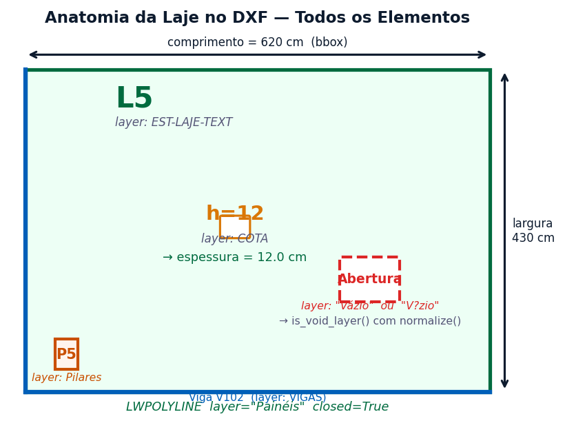
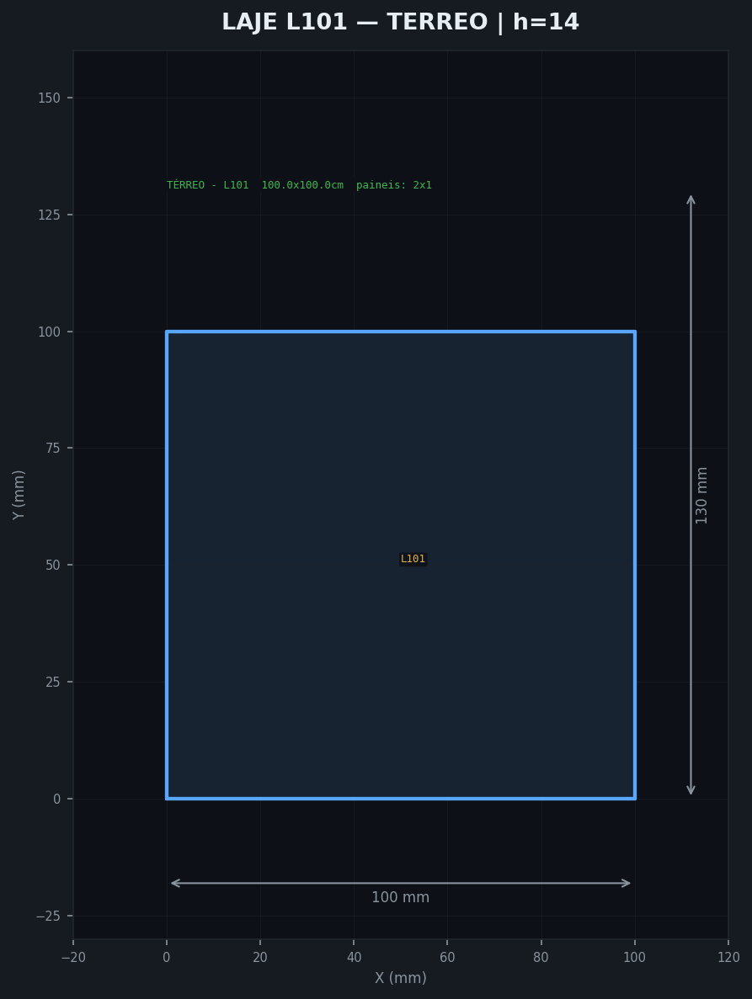
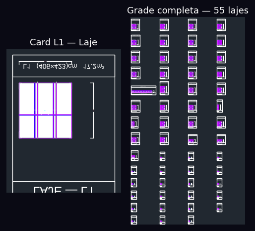

# FICHA DE COMPREENSÃO — SLAB (Robô de Lajes)

**Sistema:** CAD-ANALYZER v2.0
**Robô:** Slab — Especialista em Lajes (Slab Robot)
**Responsável:** Fase 6 do Pipeline CAD-ANALYZER (Execução CAD)
**Versão do Documento:** 2.0 | 2026-03-22
**Gerador STOG:** `gerar_lj_dxf_stog.py` (ezdxf, sem AutoCAD)

---

## 1. IDENTIDADE DO ROBÔ

| Atributo | Valor |
|----------|-------|
| **Nome** | Slab |
| **Função** | Geração de DXF STOG-quality de escoramento e forma de laje |
| **Escopo** | Lajes de concreto armado — escoramento, painéis, vigotas/barrotes, pontaletes |
| **Norma** | NBR 6118 (concreto), NBR 14931 (concretagem), NR-18 (segurança em obras) |
| **Gerador** | `gerar_lj_dxf_stog.py` (lajes) |
| **JSON Fonte** | `Fase-4_Sincronizacao/JSON_Lajes/L*.json` |

---

## 1.5. POSIÇÃO NO PIPELINE CAD-ANALYZER

```
DXF Estrutural Bruto (TMC-EST-*.dwg)
    ↓
DXF STOG LJ Real (eng. reversa MANUAL pelo engenheiro no AutoCAD)
    ↓
Fase-1  Ingestão DXF STOG             → *LJ*.dxf (7 arquivos por obra)
Fase-3  Extração Parâmetros            → extrair_lajes_lj.py (AUX00 + labels)
                                          extrair_poligono_lajes.py (polígono + dims)
Fase-4  Sincronização JSON             → JSON_Lajes/L*.json
         ↓
[SLAB ENTRA AQUI — 2 caminhos]
         ↓
Caminho A: gerar_lj_dxf_stog.py       → LJ_stog_{ts}.dxf (grid de cards)
Caminho B: Robô PySide (SmartPanner)   → .scr → AutoCAD → DXF nativo
         ↓
Fase-7  comparar_lajes_stog_vs_gerado.py → validação (meta 75%)
```

> **Nota:** O Robô PySide (`Robo_Lajes/`) usa SmartPanner + Groq/Gemini + AutoCAD COM.
> O gerador STOG (`gerar_lj_dxf_stog.py`) é o caminho autônomo (sem AutoCAD).

## 1.6. CONTEXTO ESTRUTURAL — ANATOMIA DA LAJE





## 1.7. MODELO DE DADOS DO ROBÔ ORIGINAL (PySide)

```python
class Laje:
    numero: int                    # ID numérico
    nome: str                      # "L11", "L2A"
    comprimento: float             # dim X (cm)
    largura: float                 # dim Y (cm)
    pavimento: str                 # "TÉRREO", "12 PAV"
    coordenadas: list              # [[x,y], ...] polígono fechado
    area_cm2: float
    linhas_verticais: list         # [{"value": 100.0, "is_union": false}, ...]
    linhas_horizontais: list       # [{"value": 50.0, "is_union": true}, ...]
    obstaculos: list               # retângulos de obstáculo
    modo_selecionado: int          # 0=auto, 1=manual
    reaproveitamento_dados: dict   # dados de reaproveitamento entre pavimentos
    sobras_recebidas: list         # painéis sobra recebidos do pavimento anterior
```

## 1.8. SmartPanner — Motor de Distribuição de Painéis

```
Constantes de engenharia (engenharia reversa do Robô):
  Painel padrão maior:  244 cm
  Painel padrão médio:  122 cm
  Painel padrão menor:   60 cm
  GAP união (sarrafo):   20 cm (pref), range 15-30
  Limiar eixo menor:    200 cm
  Sobra mínima:          60 cm

Algoritmos (em ordem de prioridade):
  1. _distribute_244_rule(L)      — preenche 244, se sobra < 60 troca último por 122
  2. _distribute_minor_axis(L)    — se < 200cm, lógica especial
  3. _distribute_elastic(L, obs)  — painéis 122/60 com uniões 0-30cm
  4. _try_align_deformity(L, obs) — alinha com borda de obstáculo
  5. _distribute_greedy_fallback() — fallback: 122 + gap 20

LayoutLearner: KNN (sklearn) + Groq/Gemini para sugerir layout
```

---

## 2. O QUE SLAB PROCESSA

### Entrada (INPUT)

Slab recebe uma **ficha de laje** com os seguintes campos:

```
Laje_name            — Nome da laje (ex: L1, L2A, LAJ-1)
Laje_laje_dim        — Espessura (ex: d=12, d=15, d=20)
Laje_laje_outline_segs — Tipo dos segmentos do contorno (Polyline | Line)
Laje_laje_nivel      — Nível/cota da laje (ex: 747,40 / 745,50)
Laje_laje_islands    — Ilhas (aberturas) na laje (Polyline | null)
Laje_id_item         — Identificador interno
```

### Processamento (ENGINE)

Slab usa o **SlabTracer** para:

1. **Detecção do contorno**: Encontra a polilinha fechada que delimita a laje
2. **Detecção de ilhas**: Identifica aberturas internas (shafts, aberturas para instalações)
3. **Cálculo do escoramento**: Determina posicionamento de pontaletes e vigotas
4. **Layout de painéis**: Distribui painéis de compensado sobre a laje
5. **Geração de DXF**: Exporta vista de topo com escoramento completo

### Saída (OUTPUT)

```
lajes_{obra}_{pavimento}.dxf  — DXF com escoramento de todas as lajes do pavimento
```

---

## 2.5. JSON FASE-4 — SCHEMA COMPLETO (LJ)

```json
{
  "numero": 11,
  "nome": "L11",
  "comprimento": 2154.4,        // dimensão X em cm
  "largura": 244.0,             // dimensão Y em cm
  "pavimento": "LAJE TÉCNICA",
  "coordenadas": [              // polígono fechado (primeiro = último ponto)
    [0.0, 0.0], [2154.4, 0.0], [2154.4, 244.0], [0.0, 244.0], [0.0, 0.0]
  ],
  "area_cm2": 525673.6,
  "linhas_verticais": [         // divisões verticais (pontaletes/sarrafos)
    {"value": 100.0, "is_union": false},   // value = posição X em cm
    {"value": 200.0, "is_union": true}     // is_union = sarrafo de pressão (junção)
  ],
  "linhas_horizontais": [],     // divisões horizontais (mesmo formato)
  "obstaculos": [],             // obstáculos retangulares dentro da laje
  "modo_selecionado": 0,        // 0=auto, 1=manual
  "unioes_nos_bordes": false,
  "observacoes": ""
}
```

> **Nota:** Obra_TREINO_1 tem JSONs default (100×100). Dados reais em Obra_TREINO_21 (19 lajes).

## 2.6. LAYERS STOG REAL vs GERADOR

| Layer STOG Real | ACI | Conteúdo Real | Layer Gerador | Status |
|-----------------|-----|---------------|---------------|--------|
| `3` (verde) | 3 | Contornos, sarrafos, textos dim (501 LINE + 181 POLY + 141 TEXT) | -- | FALTANDO |
| `4` (ciano) | 4 | Labels L{n}, V{n}, P{n} | -- | FALTANDO |
| `7` (branco) | 7 | Pilares (retângulos 19×66, 24×80) | -- | FALTANDO |
| `9` | 9 | Marcadores SOLID (triângulos) + escoras (LINEs densas) | -- | FALTANDO |
| `1` (vermelho) | 1 | X cruzado = painel com reaproveitamento | -- | FALTANDO |
| `AUX00` | 7 | MTEXT "L{n}\n{dim1}X{dim2}\nc/rec." | -- | FALTANDO |
| `Painéis` | 200 | LWPOLYLINE contorno + DIMENSION cotas | `Painéis` (200) | OK |
| `Hachura` | 251 | HATCH SOLID fill | `Hachura` (251) | OK |
| `REAPROVEITAMENTO` | 251 | HATCH por laje reutilizada | Definido, não usado | FALTANDO lógica |
| `SARRAFO DE PRESSÃO` | 251 | Linhas de pressão | `SARRAFO DE PRESSAO` (251) | OK |
| `CARIMBO` | 255 | Carimbo | `CARIMBO` (255) | OK |
| `Folhas` | 255 | Bordas | `Folhas` (255) | OK |

> **Gap crítico:** 6 layers do STOG real não existem no gerador (3, 4, 7, 9, 1, AUX00)

---

## 3. ANATOMIA DE UMA LAJE NO DXF

```
┌─────────────────────────────────────────────────────────────────────┐
│  UMA LAJE (ex: L2A, d=12) NO DXF APARECE COMO:                      │
│                                                                     │
│  CONTORNO PRINCIPAL:                                                │
│  ┌──────────────────────────────────┐                               │
│  │  LWPOLYLINE fechada              │ ← layer: SCO-___-LAJ ou '0'  │
│  │  (polilinha do perímetro da laje)│   ou layer numérico (TQS)    │
│  │                                  │                               │
│  │  TEXTO próximo: "L2A" ou "d=12"  │ ← layer: NOMENCLATURA        │
│  │                                  │                               │
│  │  ┌──────────┐  ILHA/ABERTURA     │ ← LWPOLYLINE fechada interna │
│  │  │ (shaft)  │  layer: idem       │   (ilha da laje)             │
│  │  └──────────┘                    │                               │
│  └──────────────────────────────────┘                               │
│                                                                     │
│  CLASSIFICAÇÃO AUTOMÁTICA:                                          │
│   - Polilinha fechada de grande área (> média dos pilares)          │
│   - aspect_ratio tipicamente próximo de 1.0 a 3.0                  │
│   - Texto próximo começa com "L" ou contém "d=" ou "h="            │
│   - layer SCO-___-LAJ é indicativo forte de laje                   │
└─────────────────────────────────────────────────────────────────────┘
```

---

## 4. LAYERS RELEVANTES PARA SLAB

| Layer | Conteúdo | Família DXF |
|-------|----------|-------------|
| `SCO-___-LAJ` | Contorno da laje (escoramento) | Ambas |
| `CONCRETO` | Área de concreto da laje | BIM |
| `Painéis` | Painéis de compensado da forma | Ambas |
| `Madeira` | Barrotes e pontaletes | Ambas |
| `COTA` | Cotas de dimensão | Ambas |
| `Hachura` | Hachuramento de área | BIM |
| `0` (default) | Contornos em projetos TQS | TQS |
| `NOMENCLATURA` | Textos identificadores (L1, d=12) | Ambas |

---

## 5. MODELO DE DADOS (SQLITE)

### Tabela `slabs` em `project_data.vision`

```sql
id               TEXT  PRIMARY KEY
project_id       TEXT  — FK para projects
name             TEXT  — Nome da laje (L1, L2A, LAJ-1...)
type             TEXT  — Tipo (floor, roof, cantilever...)
area             REAL  — Área calculada (m²)
points_json      TEXT  — Vértices do polígono de contorno (SlabTracer)
links_json       TEXT  — Conexões com vigas/pilares na borda
validated_fields_json  TEXT  — Campos validados pelo usuário
na_fields_json   TEXT  — Campos N/A
issues_json      TEXT  — Problemas detectados (contorno aberto, ilha sem fecho...)
is_validated     BOOLEAN
pkl_path         TEXT  — Cache serializado
```

**Total de lajes no banco:** 4.637

---

## 6. REGRAS DE TRANSFORMAÇÃO (Slab)

| Campo | Acurácia Global | Status | Distribuição dos Valores |
|-------|-----------------|--------|--------------------------|
| Laje_laje_outline_segs | 79.6% | ⚠️ QUASE PRODUÇÃO | Polyline (80%), Line (20%) |
| Laje_laje_dim | 71.5% | ⚠️ MÉDIA | d=12 (46%), d=15 (24%), d=18 (12%), d=20 (9%)... |
| Laje_name | **6.9%** | ❌ CRÍTICO | 51 valores únicos em 88 eventos |
| Laje_laje_nivel | 41.9% | ⚠️ BAIXA | 7 valores únicos — nível varia por projeto |
| Laje_id_item | 50.0% | ⚠️ MÉDIA | 5 valores únicos em 9 eventos |
| Laje_laje_islands | 50.0% | ⚠️ MÉDIA | 2 eventos apenas (insuficiente) |

### ⚠️ Laje_name: Problema Crítico de Semântica

Laje_name tem a **pior acurácia de todo o sistema** (6.9%).
O motivo: cada projeto tem um conjunto completamente diferente de nomes de laje.
Com 51 valores únicos em apenas 88 eventos, não é possível generalizar.

**Estratégia recomendada:**
1. Usar **busca por proximidade textual** (textos "L\d+" ou "LAJ-\d+" próximos da laje)
2. Nunca usar global_default para Laje_name — pedir confirmação sempre
3. Mostrar lista de sugestões ao usuário com base nos textos no DXF

---

## 7. LEARNING MAP (Sistema de Aprendizado Slab)

O Slab tem seu próprio banco de aprendizado em:
`_ROBOS_ABAS/Robo_Lajes/laje_src/data/learning_map.db`

### Tabelas:

**`training_examples`** — Exemplos de treinamento por característica geométrica
```sql
area, perimetro, aspect_ratio, convexidade, num_vertices,
num_ilhas, area_ilhas_relativa, bbox_width, bbox_height,
compactness, modo_calculo, linhas_verticais, linhas_horizontais,
opcoes_extras, comentarios, feedback_type
```

**`interpretation_rules`** — Regras de interpretação customizadas
```sql
id, content TEXT, created_at DATETIME
```

**Status atual:** VAZIO — nenhum exemplo de treinamento registrado ainda.
O learning_map.db é a versão local/isolada do Slab, enquanto os dados
principais estão em `project_data.vision`.

---

## 8. DESAFIOS DE COMPREENSÃO SEMÂNTICA DAS LAJES

### Por que lajes são mais difíceis que pilares e vigas?

```
Pilar → shape simples (retângulo), tamanho pequeno, 1 texto próximo
Viga  → shape alongado (linhas paralelas), posição previsível (entre pilares)
Laje  → shape QUALQUER, pode ter ilhas, bordas irregulares,
        pode estar recortada por vigas, pode ser contorno multi-curvo
```

### Os 4 Tipos de Problemas de Laje no DXF

```
TIPO 1: Contorno aberto
  └─ A polilinha não está fechada → Slab não consegue calcular área
  Solução: SlabTracer fecha o contorno usando tolerância de 10mm

TIPO 2: Laje com ilha mas ilha não detectada
  └─ Abertura interna existe mas está em layer diferente
  Solução: Busca dentro da bbox da laje em todos os layers

TIPO 3: Contorno de laje = contorno de pavimento
  └─ Confusão entre perímetro do pavimento e perímetro da laje
  Solução: Filtragem por area_relativa < 0.6 do pavimento total

TIPO 4: Laje sem texto identificador
  └─ O nome "L2" está em outro arquivo (tabela de lajes separada)
  Solução: Match por proximidade com arquivo de especificações
```

---

## 9. PIPELINE DE EXECUÇÃO DO SLAB

```
DXF de Entrada (por pavimento)
    ↓
[1] DXFIngestor
    → Detecta familia DXF
    → Extrai polilinhas grandes (area > threshold)
    → Extrai textos "L\d+" e "d=\d+"
    ↓
[2] SlabTracer
    → Identifica contornos fechados de laje
    → Detecta ilhas (aberturas internas)
    → Calcula área, perímetro, aspect_ratio
    → Associa textos próximos ao contorno
    ↓
[3] StructuralVectorizer
    → Classifica: Laje (área grande, polilinha fechada)
    → FeatureVector: [aspect, area_norm, n_verts, 1.0, layer_hash, color, 0, 0]
    → DNA key para lookup em transformation_rules
    ↓
[4] TransformationEngine (transformation_rules lookup)
    → Prediz: laje_dim (d=12?), laje_outline_segs (Polyline?)
    → NUNCA prediz Laje_name automaticamente (accuracy 6.9%)
    → Usa global_default como sugestão inicial apenas
    ↓
[5] REVISÃO HUMANA (Serra + Mestre)
    → Confirma nome, espessura, nível
    → Valida contorno e ilhas visualmente
    → training_events registrados
    ↓
[6] Slab gera DXF de escoramento
    → Pontaletes e vigotas distribuídos por grid
    → Painéis de compensado em módulos
    → Cotas e identificação
```

---

## 10. COMPREENSÃO SEMÂNTICA — RESUMO EXECUTIVO

```
ELEMENTO        COMO APARECE NO DXF             DICA DE IDENTIFICAÇÃO
─────────────── ─────────────────────────────── ────────────────────────────────
Pilar           Polilinha pequena (< 10k mm²)   Texto "P\d+" próximo
                Quase quadrada (aspect < 2)      Layer CONCRETO ou SOLID

Viga            Polilinha alongada (aspect > 3)  Texto "V\d+[a-z]?" próximo
                Face_A + Face_B paralelas        Layer Painéis ou bordas da viga

Laje            Polilinha GRANDE (> 100k mm²)   Texto "L\d+" ou "d=\d+" próximo
                Fechada, pode ter ilhas          Layer SCO-___-LAJ ou 0

Forma           Múltiplas linhas paralelas       Texto "SARR" no layer name
                Layer SARR_*, Madeira            Posicionadas sobre viga/pilar
```

---

## 11. MÉTRICAS DE PERFORMANCE (2026-03-18)

```
Total de lajes no banco:    4.637
training_events (Laje):     453 eventos (maior categoria)
Regras de transformação:    5 regras (1 em produção: Laje_laje_outline_segs ~79.6%)
Acurácia média das regras:  50.0% (limitada por Laje_name = 6.9%)
Acurácia excluindo nome:    65.9%
Campo crítico sem solução:  Laje_name (51 valores únicos, projeto-específico)
```

---

## 11.5. GAPS CRÍTICOS: GERADOR STOG vs STOG REAL

| Gap | Impacto | Descrição |
|-----|---------|-----------|
| SmartPanner não integrado | ALTO | Gerador só plota linhas do JSON — não calcula distribuição 244/122/60 |
| Reaproveitamento ignorado | ALTO | Modelo tem `sobras_recebidas`, `reaproveitamento_dados` — gerador ignora |
| AUX00 MTEXT ausente | ALTO | STOG real tem "L{n}\n{dim}X{dim}\nc/rec." — essencial p/ rastreabilidade |
| 6 layers faltando | MÉDIO | Layers 3,4,7,9,1,AUX00 do STOG real não existem no gerador |
| Layout grid vs planta | MÉDIO | STOG real = planta posicional (coordenadas absolutas); gerador = grid cards |
| Obstáculos | MÉDIO | JSON suporta `obstaculos[]` mas gerador ignora |
| Pilares na laje | MÉDIO | STOG real tem retângulos de pilares (layer 7); gerador não posiciona |
| Dados default | BAIXO | Obra_TREINO_1 tem JSONs 100×100 (não populados pela extração) |

---

## 12. COMANDO DE GERAÇÃO LJ

```bash
# Geração LJ STOG (todas as lajes de uma obra)
python scripts/gerar_lj_dxf_stog.py \
  --obra D:/Agente-cad-PYSIDE/DADOS-OBRAS/Obra_TREINO_1

# Limitar lajes (debug rápido)
python scripts/gerar_lj_dxf_stog.py \
  --obra D:/Agente-cad-PYSIDE/DADOS-OBRAS/Obra_TREINO_1 \
  --max 5

# Output: Fase-6_Execucao_CAD/LJ_stog_{timestamp}.dxf
#         Fase-6_Execucao_CAD/LJ_stog_quality.png
```



---

## 13. RECOMENDAÇÕES DE MELHORIA (Athena — CEO-PLANEJAMENTO)

1. **Laje_name:** Implementar busca de texto no DXF por regex `L\d+[A-Za-z]?` dentro da
   bbox expandida da laje. Oferecer os 3 textos mais próximos como sugestões ao usuário.

2. **Laje_laje_nivel:** O nível varia por projeto e por pavimento. Implementar herança
   de nível do pavimento (campo `level_arrival` em `projects`) como valor inicial.

3. **Laje_laje_dim:** Expandir training_events para obras diversas. Atualmente 87% dos
   eventos são de apenas 2 obras. Mais diversidade → melhor generalização.

4. **Learning_map.db:** Iniciar captura de exemplos geométricos (área, perímetro, convexidade)
   para treinar um classificador local de modo de cálculo do Slab.

---

*Ficha técnica Slab v3.0 | CAD-ANALYZER | Diana Corporação Senciente*
*Atualizada em 2026-03-22 | v3: SmartPanner, JSON schema, layers STOG real vs gerado, gaps, modelo Laje*
